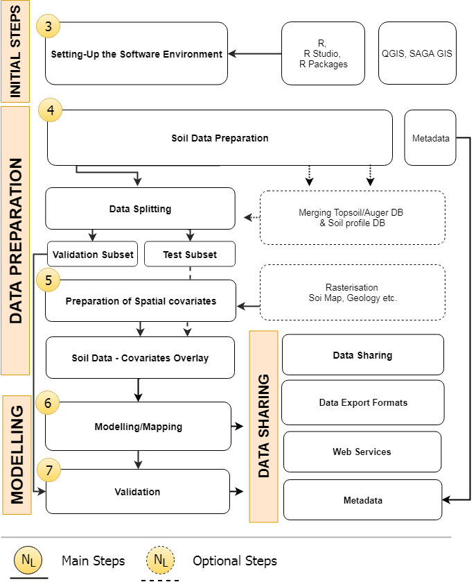

\mainmatter
\pagestyle{fancy}

# Presentation

Soils provide ecosystem services critical to life on Earth. The Food and Agricultural Organization of the United Nations (FAO) recognizes the need to preserve soil resources from degradation and restore them. In 2012, the Global Soil Partnership (GSP) was established to improve soil governance and promote sustainable soil management \index{Sustainable soil management}. 

The GSP aims to promote sustainable soil management \index{Sustainable soil management} at all levels globally through normative tools relying on evidence-based science. Understanding the status of a given soil in different land uses, including its properties and functions, and relating this information to the various ecosystem services provided by soils, becomes mandatory for sustainable soil management \index{Sustainable soil management} decisions. As the availability and use of soil data and information is fundamental to underpin these decisions, members of the GSP decided to establish a Global Soil Information System (GLOSIS) 
\index{Soil Information System (SIS)!global} based on the development of national soil information systems \index{Soil Information System (SIS)!national}.

In the process of establishing GLOSIS, a number of tools and networks are being created, including the International Network of Soil Information Institutions (INSII), a [*GSP Soil Data Policy*](http://www.fao.org/3/a-bs975e.pdf) [@gsp_data_2017] and more. Taking advantage of this process and responding to a request for support in addressing the Sustainable Development Goal Indicators, especially indicator 15.3 which includes the restoration of degraded soils, the GSP Plenary Assembly in 2016 instructed the Intergovernmental Technical Panel on Soils (ITPS) and the GSP Secretariat to develop the first-ever Global Soil Organic Carbon Map (GSOCMap) \index{Global Soil Organic Carbon Map (GSOCMap)} following the same bottom-up approach as GLOSIS. To this end, members under the INSII umbrella developed guidelines and technical specifications for the preparation of the [GSOCMap](http://www.fao.org/3/a-bp164e.pdf) \index{Global Soil Organic Carbon Map (GSOCMap)} and countries were invited to prepare their national soil organic carbon maps according to these specifications.

Given the scientific advances in tools for mapping soil organic carbon (SOC), many countries requested the GSP Secretariat to support them in the process of preparing national maps, hence an intensive capacity development programme on SOC mapping has been implemented to support countries in this process. Various regional and national training sessions were organized using an on-the-job-training modality to ensure national experts were trained to utilize their own datasets to produce reliable SOC maps. The GSP Secretariat invited a group of experts to prepare the first edition of a [*Soil Organic Carbon Mapping Cookbook*](http://www.fao.org/3/a-bs901e.pdf) [@cookbook_2017] as a comprehensible reference knowledge source to support the capacity development process.

The second edition of the cookbook provides generic methodologies and technical steps to produce SOC maps. This edition has been updated with knowledge and practical experiences gained during the implementation process of GSOCmap V1.0 \index{Global Soil Organic Carbon Map (GSOCMap)} throughout 2017. The cookbook includes step-by-step guidance for developing 1 km grids for SOC stocks, as well as for the preparation of local soil data, the compilation and preprocessing of ancillary spatial data sets, upscaling methodologies, and uncertainty assessment methods. Guidance is mainly specific to SOC data, but as this cookbook contains generic Sections on soil grid development it can be applicable to map various soil properties. 

The guidance is focusing on the upscaling of national SOC stocks in order to produce the GSOCMap \index{Global Soil Organic Carbon Map (GSOCMap)}. Therefore, the cookbook supplements the [*GSP Guidelines for Sharing National Data/Information to Compile a Global Soil Organic Carbon (GSOC) Map*](http://www.fao.org/3/a-bp164e.pdf) [@gsp_guidelines_2017], providing technical guidelines to prepare and evaluate spatial soil data sets to: 

* Determine SOC stocks from local samples to a target depth of 30 cm;
* Prepare spatial covariates \index{Environmental covariates} for upscaling; and
* Select and apply the best suitable upscaling methodology.

In terms of statistical upscaling methods, the use of conventional upscaling methods using soil maps and soil profiles is still very common, although this approach is mostly considered empirical by soil mappers. Even though evaluations are based on polygon soil maps, the resulting SOC maps can be rasterized to any target grid. However, a spatially-explicit assessment of uncertainties is impossible. The use of digital soil mapping to upscale local soil information is increasingly applied and recommended.

This cookbook presents two approaches in detail, namely spatial modelling using either regression or data mining analysis \index{Random forest (RF)}, combined with geostatistics such as regression-kriging \index{Regression-kriging (RK)}. The second edition includes updates on uncertainty assessment of the presented methods.

It is our hope that this cookbook will fulfill its mandate of easily enabling any user to produce a digital SOC or other soil property map using soil legacy data and modern methods of digital soil mapping \index{Digital Soil Mapping (DSM)} with the overall aim for improved decision making on soil management.

## 	How to use this book

In the second edition of this cookbook, we want to introduce five different approaches for obtaining a SOC map, using an example soil data set from the Former Yugoslav Republic of Macedonia (FYROM).

The first two mapping methods presented are classified as conventional upscaling using soil maps. The first one is class-matching \index{Class-matching}. In this approach, we derive average SOC stocks per class from the soil type for which a national map exists, or through combination with other spatial covariates (e.g. land use category, climate type, biome, etc.) \index{Environmental covariates}. This approach is used in the absence of spatial coordinates of the source data. The second one is geo-matching \index{Geo-matching}, were upscaling is based on averaged SOC values per mapping unit.

In addition to that, we present three methods from digital soil mapping \index{Digital Soil Mapping (DSM)}. Regression-kriging \index{Regression-kriging (RK)} is a hybrid model with both, a deterministic and a stochastic component [@hengl2007regression]. Next method is called random forest \index{Random forest (RF)}. This one is an ensemble of regression trees based on bagging. This machine learning algorithm uses a different combination of prediction factors to train multiple regression trees [@Breiman1996]. The last method is called support vector machines \index{Support Vector Machines (SVM)}. This method applies a simple linear method to the data but in a high-dimensional feature space non-linearly related to the input space [@Karatzoglou2006].

We present this diversity of methods because there is no *best* mapping method for digital soil mapping \index{Digital Soil Mapping (DSM)} and testing, and selection has to be done for every data scenario [@guevara_2018].

```{r grworkflow, fig.cap="Proposed graphical workflow for producing a SOC map from data preparation to final result publishing" , out.width='80%', echo=FALSE, fig.align='center'}

```

> This cookbook is a step-by-step manual starting with the soil data preparation, producing the map, and finishing with map validation and data sharing (see Fig. \@ref(fig:grworkflow)). In the different chapters, we present a continuing example using the FYROM soil database and some environmental covariates. In every chapter, we start with the input data and produce the proposed output, which is usually used as input for the following chapter. The soil data needed can be downloaded from the [data repository](https://github.com/FAO-GSP/SOC-Mapping-Cookbook/tree/master/data), and the same applies to the [environmental covariates](https://github.com/FAO-GSP/SOC-Mapping-Cookbook/tree/master/covs). The results obtained in every chapter can be also downloaded for comparison purposes from the [result folder](https://github.com/FAO-GSP/SOC-Mapping-Cookbook/tree/master/results). Finally, all the needed code is summarized in Chapter \@ref(compendium) and can be downloaded from the [code folder](https://github.com/FAO-GSP/SOC-Mapping-Cookbook/tree/master/code).

The authors use the Github development environment to build this document. We produced also an online version of the cookbook to be able to implement minor changes/improvements  without reprinting. We encourage users to follow the online  version which is provided on the GSP website.  

## The FYROM soil database

The sample data set used for the spline function and the regression-kriging for digital soil mapping in this cookbook has been extracted from the [Macedonian Soil Information System Database](http://www.maksoil.ukim.mk/) (MASIS). The database contains around 4,000 soil profiles with 11,000 horizons. The MASIS was developed with support from the FAO and the GSP. Decades of archived soil research have now been transformed into an accurate, up-to-date, and fully functioning information system, based on state-of-the-art digital soil mapping techniques.

Soils are a precious resource in this landlocked country, but climate change and other threats, including heavy human activities, are degrading the soils at an alarming rate. Without a proper evidence base such as a soil information system (SIS) \index{Soil Information System (SIS)!national}, the FYROM had no systematic way of making decisions to promote sustainable soil management, or of monitoring soil conditions and functions over time. Since soil information is needed to guide sustainable soil and land management, this has contributed to stagnating agricultural development.

Bringing MASIS to life took just over two years and was completed in four phases. The first phase involved compiling, evaluating and systemizing more than 100 existing hardcopy soil maps that contained information on over 80% of the country, and soil legacy data from about 15,000 soil profiles. The missing 20% was complemented with an advanced soil survey.

The data were then used to develop a spatial geo-database within MASIS. This led to the production of a national soil map compliant with both, European and global standards, in phase two of the project. 

The MASIS is available at the following link: http://www.maksoil.ukim.mk/.

## Foreword to the first edition

The first edition of the cookbook provides step-by-step guidance for developing 1 km grids for the mapping of soil carbon stocks. It includes the preparation of local soil data, the compilation and pre-processing of ancillary spatial data sets, upscaling methodologies, and uncertainty assessments. Guidance is mainly specific to soil carbon data, but also contains many generic sections on soil grid development, as it is relevant for other soil properties.

Therefore, this first edition is the beginning of a series of updates and extensions, necessary to cover a larger variety of upscaling approaches. Experiences gained throughout 2017 during the GSOCmap programme, through applications at country scale and various trainings scheduled for 2017, shall be considered in the next editions. Also, the section on uncertainties will be adjusted to more practical implementation steps.

## Foreword to the second edition

This second edition has been updated with knowledge and practical experiences gained during the implementation process of GSOCmap V1.0 throughout 2017. The cookbook includes step-by-step guidance for developing 1 km grids for SOC stocks, as well as for the preparation of local soil data, the compilation and preprocessing of ancillary spatial data sets, upscaling methodologies, and uncertainty assessment methods. Guidance is mainly specific to soil organic carbon data, but as this cookbook contains generic sections on soil grid development, it can be applicable to map various soil properties. 
