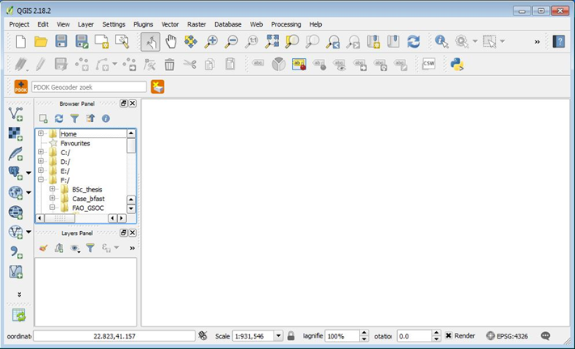
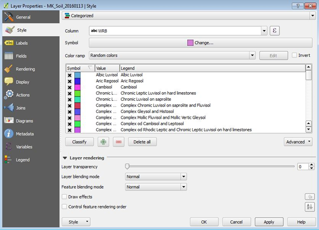
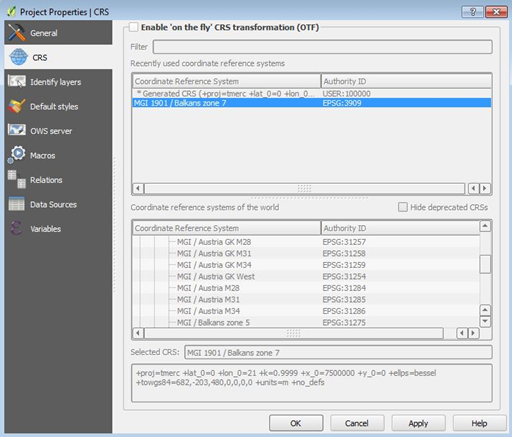
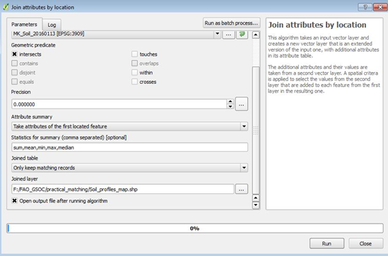
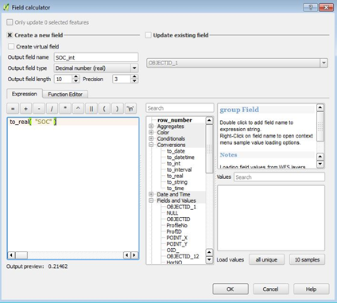
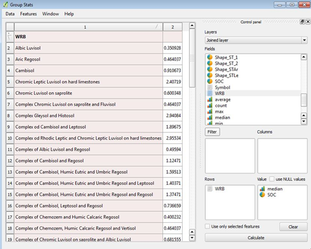
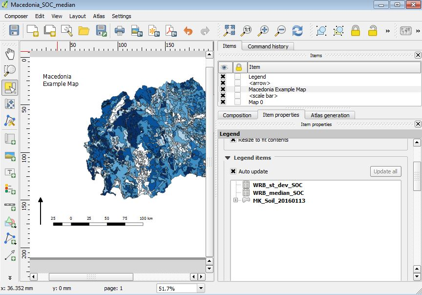
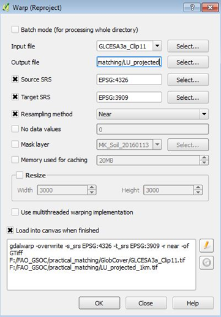

# Mapping methods {#mappingMethods}
*R. Baritz, M. Guevara, V.L. Mulder, G.F. Olmedo, C. Thine, R.R. Vargas, Y. Yigini*

In this Chapter, we want to introduce five different approaches for obtaining the SOC map for FYROM. The first two methods presented in Section \@ref(convUpscaling) are classified as conventional upscaling and the presented methods in the Sections \@ref(RK), \@ref(rf), and \@ref(svm) are approaches from DSM.

The first method is class-matching. In this approach, we derive average SOC stocks per class either from the soil type for which a national map exists, or through the combination with other spatial covariates such as land use category, climate type, biome, etc. This approach is used in the absence of spatial coordinates of the source data. The second conventional upscaling method is geo-matching, were upscaling is based on averaged SOC values per mapping unit.

Furthermore, we present three methods from DSM. Regression-kriging (RK) is a hybrid model with both, a deterministic and a stochastic component [@hengl2007regression]. Next method is called random forest (RF). This one is an ensemble of regression trees based on bagging. This machine learning algorithm uses a different combination of prediction factors to train multiple regression trees [@Breiman1996]. The last method is called support vector machines (SVM). This method applies a simple linear method to the data but in a high-dimensional feature space, non-linearly related to the input space [@Karatzoglou2006]. We present this diversity of methods because there is no *best* mapping method for DSM, and testing and selection has to be done for every data scenario [@guevara_2018].

The authors of this Chapter used **R** packages. To run the code provided in this Chapter, the following packages need to be installed in the **R** user library. If the packages are not yet installed, the `install.packages()` function can be used.

```{r, eval=FALSE}
# Installing packages for Chapter 'Mapping Methods'
install.packages(c("sp", "car", "automap",
                   "randomForest", "caret", "Metrics",
                   "quantregForest", "snow", "reshape",
                   "e1071"))
```

## Conventional upscaling using soil maps {#convUpscaling}
*R. Baritz, V.L. Mulder*

### Overview

The two conventional upscaling methods in the context of SOC mapping, are described by @lettens2004soil. Details about weighted averaging can be found in @hiederer2013mapping. Different conventional upscaling approaches were applied in many countries e.g. by @krasilnikov2013soils (Mexico), @greve2007generating (Denmark), @kolli2009stocks (Estonia), @arrouays2001carbon (France), and @bhatti2002estimates (Canada). Because the structure of soil map databases differs between countries (e.g. definition of the soil mapping unit, stratification, soil associations, dominating and co-dominating soils, typical and estimate soil properties for different depths), it is difficult to define a generic methodology for the use of these maps for mapping soil property information. 

However, the essential principle which is commonly used, is to combine soil property data from local observations with soil maps via class-matching and geo-matching. 

### Diversity of national soil legacy data sets

In order to develop a representative and large national soil database, very often, data from different sources (e.g. soil surveys or projects in different parts of the country at different times) are combined. The following case of Belgium demonstrates, how available legacy databases could be combined. Three different sources are used to compile an overview of national SOC stocks:

* **Data source 1**: Soil profile database with 13,000 points of genetic horizons; for each site, there is information about the soil series, map coordinates, and land use class; for each horizon, there is information about depth and thickness, textural fractions and class, volume percentage of rock fragments; analytically, there is the organic carbon content and inorganic carbon content. 

* **Data source 2**: Forest soil data base which includes ectorganic horizons. According to their national definition, the term *ectorganic* designates the surface horizons with an organic matter content of at least 30%, thus, it includes both the litter layer and the organic soil layers. For the calculation of SOC stocks for the ectorganic layer, no fixed-depth was used, instead, the measured thickness of the organic layers and litter layers was applied.

* **Data source 3**: 15,000 soil surface samples were used (upper 20 cm of mineral soil); carbon measurements are available per depth class.

From all data sources, SOC stocks for peat soils were calculated separately.

### Technical steps - Class-matching

**Step 1 - Data preparation**

1. Separate the database for forests, peat, and other land uses. If only horizons are provided, derive or estimate average depth of horizons per soil type, and add upper and lower depth.
2. Check the completeness of parameters per depth using the solum depth to code empty cells. 
3. Correct the organic carbon in case total carbon was determined (total carbon minus inorganic carbon concentration).
4. Correct the Walkley and Black method for incomplete oxidation (using the correction factor of 1.32 for the quantification of the organic carbon content in the soil samples) [@walkley1934examination].
5. If BD measured is lacking, select proper PTFs and estimate BD. Publications about the choice of the best suited PTF for specific physio-geographic conditions are available.
6. If the stone content is missing, investigate using other data sources or literature, to which a correction for stones should be applied.
7. If possible, derive the standard average stone content for different soils/horizons/depths, or used published soil profiles, as a simple correction factor.
8. Calculate SOC stocks for all mineral and peat soils over 0 cm - 30 cm, and optionally for forest organic layers, and peat between >30 cm and <100 cm.

**Step 2 - Preparatory GIS operations**

1. Prepare the covariates.
2. Identify the properties of covariates for each point observation using geo-matching.
3. For mapping using **geo-matching of all points**: Extract the covariate information to all georeferenced sample sites. The SOC values from all points within the unit are then averaged. It is assumed that the points represent the real variability of soil types within the units. 


**Step 3 - Mapping using class-matching of points in agreement with classes**

Through class-matching, only those points or profiles are attributed to a soil or landscape unit if both the soil and the land use class are the same. Class-matching thus can be performed regardless of the profile location. Before averaging, a weighing factor can be introduced according to the area proportions of dominant, co-dominant and associated soils. Each profile needs to be matched to its soil type/landscape type, and the SOC value averaged.

1. Determine a soil or landscape unit (e.g. national soil legend stratified by climate area and mainland cover type such as forest, grassland, cropland).
2. Calculate average SOC stocks from all soils which match the soil/landscape unit.
3. Present the soil/landscape map with SOC stocks, do not classify SOC stocks (tons/hectare) into groups (e.g. < 50, 50 - 100, > 100). 

> Note: Pre-classified SOC maps cannot be integrated into a global GSOCmap legend.  


### Technical steps - Geo-matching {#geomQGIS}

Because of its importance, geo-matching as a mapping method is described in more detail. It is neccessary to first prepare the working environment with the pre-processed input data. The following Section presents different geo-matching procedures. 

1. Setting up software and working environment.
2. Geo-matching SOC with WRB soil map (step-by-step, using the soil Map of FYROM and the demonstration data presented above).
3. Geo-matching SOC with other environmental variables: land use.
4. Finally, the development of landscape Units [@lettens2004soil] is outlined. 

This example was developed for QGIS and focusses on SOC mapping using vector data. QGIS 2.18 with GRASS 7.05 will be used. For more information, see also the following links: 

*    https://gis.stackexchange.com
*    http://www.qgis.org/
*    http://www.qgisforum.org/

**Step 1 - Setting up a QGIS project**

1. Install QGIS and supporting software; download the software at http://www.qgis.org/en/site/forusers/download.html (select correct version for Windows, MacOS or Linux, 32 or 64 bit).
2. Create a work folder, e.g. D:\\GSOC\\practical_matching. Copy the folder with the FYROM demonstration data into this folder.
3. Start QGIS Desktop with GRASS. Figure \@ref(fig:qgis) shows the start screen of QGIS Desktop. In the upper left panel, there is the **Browser Panel**, which lists the geodata used for this example. In the bottom left, the layer information is given in the **Layers Panel** for the layers displayed on the right.

```{r qgis, fig.cap="QGIS Desktop with the Browser Panel, the Layers Panel and the display of layers" , out.width='80%', echo=FALSE, fig.align='center'}

```

4.  Load the FYROM soil map. Right-click the file in the **Browser panel** and add the map to your project.
5.  Display the soil classes. Right-click on the file in the **Layers Panel** and select *Properties*. Go to the *Style* and change from *Single Symbol* to *Categorized*  as shown in Figure \@ref(fig:layerprop). Select the column WRB and press the icon *Classify* and change the colors if you want. Next, apply the change and finish by clicking the **OK-Button**.

```{r layerprop, fig.cap="Changing layer properties for the FYROM soil map" , out.width='80%', echo=FALSE, fig.align='center'}

```

6.  Ensure the correct projection for this project. Go to select *Project*, *Project Properties*, *CRS*.
In this case, you automatically use the local projection for FYROM. The EPSG code is 3909 which corresponds to MGI 1901/Balkans Zone 7 as shown in Figure \@ref(fig:qgisepsg)).

```{r qgisepsg, fig.cap="Project properties and projection settings" , out.width='80%', echo=FALSE, fig.align='center'}

```


7.  Save the project in the created folder. Load and display the pre-processed SOC point data. If a shapefile already exists, this is done the same way as described in Step 4. If you have the data as a text file, you need to create a vector layer out of that file. Go to *Layer*, *Add Layer*, *Add Delimited Text Layer*. Select the correct file and proper CRS projection. The layer should be added to your **Layers Panel** and displayed on top of the soil map.

**Step 2A - Geo-matching SOC with WRB soil map**

In **Step 2** you will make a SOC map, based on the FYROM soil map and the SOC values at the sampled points, following three steps. First you extract the soil map information for the point data, then you obtain the mean and standard deviation of the SOC stocks per soil class, based on the point data, and last you assign these values to the corresponding soil map units. The steps are described in detail below.

1. Extract the soil map information to the soil profile data by *Join Attributes by Location*. Select *Vector*, *Data Management Tools*, and *Join Attributes by Location*. Here, the target vector layers are the soil point data, and the join vector layer is the FYROM soil map. The geometric predicate is *intersects*. Figure \@ref(fig:joinloc) shows how to specify within the joined table to keep only matching records. Save the joined layer as a new file.

```{r joinloc, fig.cap="Join attributes by location" , out.width='80%', echo=FALSE, fig.align='center'}

```

2. Check the newly generated file, open the attribute table. The new file is added to the **Layers Panel**. Right-click on the file and open the attribute table. The information from the FYROM soil map is now added to the soil point data.
3. Most likely, the SOC values in the table are not numeric and thus statistics cannot be calculated. Check the data format, right-click on the file in the **Layers Panel** and check the type name of the SOC field under the tab *Fields*. If they are not integer then change the format.
4. Change of the data format: Open the attribute table and start editing (the pencil symbol in the upper left corner of your table). Open the field calculator and follow these instructions as shown in Figure \@ref(fig:fieldcalc)):

  a. Checkbox: Create a new field
  b. Output field name: Specify the name of your field
  c. Output field type: Decimal Number (real)
  d. Output field length: 10, precision: 3
  e. Expression: to_real("SOC"), the to_real function can be found under *Conversions* and the SOC field is found under *Fields and Values* 

```{r, fieldcalc, fig.cap="Example field calculator" , out.width='80%', echo=FALSE, fig.align='center'}

```

5.  After calculating the field, save the edits and leave the editing mode prior to closing the table. If changes are not saved, the added field will be lost.
6. Calculate the median SOC stock per soil type. Go to the tab *Vector* and select *Group Stats*. Select the layer from the spatial join you made in Step 2. Add the field SOC and median to the box with *Values* and the field WRB to the *Rows*. Make sure the box with *Use only selected features* is **not** checked. Now calculate the statistics. A table will be given in the left pane (see Figure \@ref(fig:groupstats)). Save this file as CSV and repeat the same for the standard deviation.

```{r groupstats, fig.cap="Calculate group statistics" , out.width='80%', echo=FALSE, fig.align='center'}

```


7.  Join the mean and standard deviation of SOC to the soil map. First, add the files generated during Step 6 to the **Layers Panel**. In the **Layers Panel**, right-click on the FYROM soil map. Go to *Properties*, select *Joins* and add a new join for both the median and standard deviation of SOC. The Join and Target Field are both WRB.
8.  Display the SOC maps. Go to the layer properties of the FYROM soil map. Go to *Style* and change the legend to a graduated legend. In the column, you indicate the assigned SOC values. Probably this is not a integer number and so you have to convert this number again to a numeric values. You can do this with the box next to the box as depicted in Figure \@ref(fig:legendstyle). Change the number of classes to e.g. 10 classes, change the mode of the legend and change the color scheme if you want and apply the settings. Now you have a map with the median SOC stocks per WRB soil class.

```{r legendstyle, fig.cap="Change the legend style to display the SOC values" , out.width='80%', echo=FALSE, fig.align='center'}
knitr::include_graphics("images/Conv_upscaling7.png")
```


9.  In order to generate a proper layout, go to *Project* and select *New Print Composer* (see Figure \@ref(fig:mapcomp)):
  a. Add map using *Layout* and *Add Map*. Define a square on the canvas and the selected map will be displayed.
  b. Similarly, title, scale bar, legend and a north arrow can be added. Specific properties can be changed in the box *Item properties*.
  c. When the map is finished, it can be exported as an image or PDF file.

```{r mapcomp, fig.cap="Example of the Map composer" , out.width='80%', echo=FALSE, fig.align='center'}

```


10.  Repeat the Steps 2 to 8 but now for the standard deviation of the SOC stocks.
11. Save the file as a new shapefile. Go to **Layers Panel**, *Save As* and select ESRI SHP format and make sure that you define the symbology export *Feature Symbology*. Now, a shapefile is generated, with both the median and standard deviation SOC stock per soil type. Redundant fields can be removed after the new file is created.

**Step 2B - Geo-matching SOC with other environmental variables: Land use**

1.    Start a new project and add the soil point data and FYROM soil map layers from the **Browser Panel**.
2.    Add the land use raster file to the **Layers Panel**. This is a raster file with 1 km resolution and projected in lat-long degrees (WGS84). For more information about this product see the online information from worldgrids: http://worldgrids.org/doku.php/wiki:glcesa3.
3.    Change the projection to the MGI 1901/Balkans Zone 7. Go to *Raster*, *Projections*, *Warp* and select the proper projection and a suitable file name, e.g. LU_projected_1km. Tick the checkbox for the resampling method and choose *Near*. This is the nearest neighbor and most suitable for a transformation of categorical data, such as land use (see Figure \@ref(fig:changeproj)).

```{r changeproj, fig.cap="Change the projection of a raster file" , out.width='80%', echo=FALSE, fig.align='center'}

```

4. In order to geo-match the soil point data with land use data, the raster file needs to be converted into a vector file. Go to *Raster*, *Conversions*, and select *Polygonize*. Set a proper output filename, e.g. LU_polygon_1km, and check the tickbox for *Fieldname*.
5.  Change the legend style into categories (Step 1-5). Now, the steps from the previous Section need to be repeated, using the land use polygon map instead of using the FYROM soil map.
6. Join attributes by location using the soil point data and the polygon land use map.
7. Calculate the median and standard deviation of SOC by using the Group Statistics for SOC and the land use classes and save the files as CSV file.
8. Add the generated CSV files to the **Layers Panel**.
9. Join the files with the land use polygon map, generated in Steps 3 and 4.
10. Change the classes in the legend and inspect the histogram with the median SOC values. Try to find a proper definition of the class boundaries (Steps 2 to 8).

**Step 2C - Joining landscape units and soil mapping units to support class- and geo-matching (optional)**

In this Section, it is outlined how SOC stocks can be mapped following the method outlined by @lettens2004soil. The general idea is that the landscape is stratified into more or less homogenous units and subsequently, the SOC stocks are obtained following the procedure outlined earlier in this practical. @lettens2004soil outlines a method to stratify the landscape into homogeneous strata with respect to land use and soil type, as was explained earlier. In order to obtain such strata, the soil map and the land use map need to be combined. This can be done using various types of software, e.g. ArcMap, GRASS, QGIS or **R**.

When using the GIS software, the only thing that needs to be done, is intersecting the vector files and dissolving the newly created polygon features. Depending on the software and the quality of your shapefile, you may experience problems with the geometry of your shapefile. Generally, ArcMap and GRASS correct the geometry when the shapefile is loaded, while QGIS does not do this automatically. There are various ways to correct the geometry, however, correcting the geometry falls outside the scope of this training. Therefore, we give some hints on how to correct your geometry prior to using the functions *Intersect* and *Dissolve*.

1. Change the land use raster map to 5 km resolution: Right-click the Lu_project_1km file, select *Save as*. Change the resolution to 5000 meters. Scroll down, check the *Pyramids* box, and change the resampling method to *Nearest Neighbour*.
2. Convert the raster map to a polygon map and add the file to the **Layers Panel**.
3. Check the validity of the soil map and land use map. Go to *Vector*, *Geometry Tools*, and select *Check Validity*.
Below you find the instructions in case you have no problems with your geometry.
4. Intersect the soil map and the land use map. In ArcGIS and QGIS you can use *Intersection* function following *Vector*, *Geoprocessing Tools* (in GRASS you have to use the function *Overlay* from the *Vector* menu).
5. Dissolve the newly generated polygons vie *Vector*, *Geoprocessing Tools*, select *Dissolve*.
6. Next, this layer can be used to continue with the class-matching or geo-matching procedures.

**How to correct your geometry When encountering problems?**

*    Run the *v_clean* tool from GRASS within QGIS. Open the *Processing Toolbox*, *GRASS GIS 5 Commands*, *Vector*, and select *v.clean*.
*    Install the plugin **Processing LWGEOM Provider**. Go to the plugins menu and search for the plugin and install it. You can find the newly installed tool in the *Processing Toolbox* by typing the name in the *Search* function.
*    Manually correct the error nodes of the vector features.

### Technical steps -  Geo-matching SOC with WRB soil map in R
*G.F. Olmedo*

Geo-matching can also be done in **R**. We will provide a example code following the steps from Section \@ref(geomQGIS) - Step 2A, using the WRB soil map.

**Step 1 - Load the soil data and soil map**

Load the shapefile including the soil map. Then load the points, and promote the points to `spatialPointsDataFrame` using the `coordinates()` function. Make sure both are in the same coordinate system. In case they aren't, you can use `spTransform()` to reproject one of the layers.

```{r, fig.cap='Soil map units and soil samples (in red) for the geo-matching exercise'}
library(raster)
# Load the soil map from a shapefile *.shp file
soilmap <- shapefile("MK_soilmap_simple.shp")

library(sp)
# Load soil data
dat <- read.csv("data/dataproc.csv")

# Promote to SpatialPointsDataFrame
coordinates(dat) <- ~ X + Y

# set the CRS for the soil samples. As if the same we will copy the 
# CRS from the soilmap object
dat@proj4string <- soilmap@proj4string

class(dat)

# We can plot the soil map units with ths soil samples data over
plot(soilmap, lwd=0.3)
points(dat, col="red", cex=0.2)
```

**Step 2 - Geo-matching**

Now, use the `over()` function to estimate the mean value of the `OCSKGM` field for every map unit.

```{r}
soilmap$OCSKGM <- over(soilmap, dat[,"OCSKGM"], fun=mean)[,1]
```

**Step 3 - Rasterize and export the results as geotiff**

Finally, convert the layer to raster, to comply with the deliverables specifications (see Chapter \@ref(deliverables)). 

```{r, fig.cap='SOC prediction map for FYROM using geo-matching'}
pred <- rasterize(soilmap, DEM, "OCSKGM")

plot(pred)

writeRaster(pred, "results/MKD_OCSKGM_GM.tif",
            overwrite=TRUE)
```


