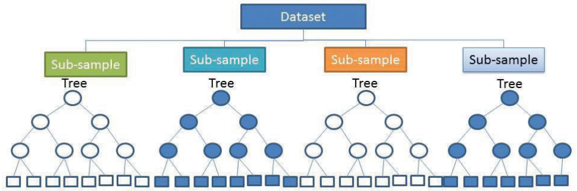

# Mapping methods
*R Baritz, VL Mulder, Y Yigini, GF Olmedo, C. Thine, RR Vargas, M Guevara*

## Conventional mapping using soil maps
*R Baritz, VL Mulder*

### Overview

The two conventional mapping methods, in the context of SOC mapping, are described by \cite{lettens2004soil}. Details about weighted averaging can be found in \cite{hiederer2013mapping}. Different conventional mapping approaches were applied in many countries (Baritz et al. 1999 (Germany), \cite{krasilnikov2013soils} (Mexico), \cite{greve2007generating} (Denmark), Koelli et al. 2009 (Estonia), \cite{arrouays2001carbon} (France), \cite{bhatti2002estimates} (Canada)). Because the structure of soil map databases differs between countries (definition of the soil mapping unit, stratification, soil associations, dominating and co-dominating soils, typical and estimate soil properties for different depths), it is difficult to define a generic methodology for the use of these maps for mapping soil property information. 

However, the essential principle which is commonly used, is to combine soil property data from local observations with soil maps via class- and geomatching. 

**Diversity of national soil legacy data sets**
in order to develop a representative and large national soil database, very often, data from different sources (e.g. soil surveys or projects in different parts of the country at different times) are combined. The following case of Belgium demonstrates how available legacy databases could be combined. Three different sources are used to compile an overview of national SOC stocks:

**Data source 1**: soil profile database with 13,000 points of genetic horizons; for each site, there is information about the soil series, map coordinates and land use class; for each horizon, there is information about depth and thickness, textural fractions and class, volume percentage of rock fragments; analytically, there is the organic carbon content and inorganic carbon content. 

**Data source 2**: forest soil data base which includes ectorganic horizons. According to their national definition, the term “ectorganic” designates the surface horizons with an organic matter content of at least 30%, thus, it includes both the litter layer and the organic soil layers. For the calculation of SOC stocks for the ectorganic layer, no fixed-depth was used, instead the measured thickness of the organic layers and litter layers was applied.

**Data source 3**: 15,000 soil surface samples were used (upper 20 cm of mineral soil); carbon measurements are available per depth class.

From all data sources, SOC stocks for peat soils were calculated separately.

### Technical steps 

**Step 1. Data preparation**

* Separate the data base for forests, peat and other land uses
If only horizons are provided: derive or estimate average depth of horizons per soil type; add upper and lower depth.
* Check completeness of parameters per depth using the solum depth to code empty cells 
* Correction of organic carbon in case total carbon was determined (total carbon minus inorganic carbon concentration)
* Correction of Walkley and Black method for incomplete oxidation (1.32)
* If BD measured is lacking, select proper pedotransfer functions (PTF) and estimate BD. There are many PTF. At best, publications about the choice of the best suited PTF for specific physio-geographic conditions are available.
* If stone content is missing, investigate using other data sources or literature, to which a correction for stones should be applied
* if possible, derive the standard average stone content for different soils/horizons/depths, or used published soil profiles, as a simple correction factor.
* Calculate SOC stocks for all mineral and peat soils over 0-30 cm, and optionally for forest organic layers and, peat >30 <100 cm.

**Step 2. Preparatory GIS Operations**

* Prepare Covariates
* Identify properties of covariates for each point observation using geo-matching 
* Mapping using geo-matching of all points: Extract the covariate information to all georeferenced sample sites. The SOC values from all points within the unit are then averaged. It is assumed that the points represent the real variability of soil types within the units 


**Step 3. mapping**

* Mapping using class-matching of points in agreement with classes

Through *class-matching*, only those points or profiles are attributed to a soil or landscape unit if both the soil and the land use class are the same. Class-matching thus can be performed regardless of the profile location. Before averaging, a weighing factor can be introduced according to the area proportions of dominant, co-dominant and associated soils. Each profile needs to be matched to its soil type/landscape type, and the SOC value averaged.
1. Determine a soil or landscape unit (e.g. national soil legend stratified by climate area and main land cover type (forest, grassland, cropland)
2. Calculate average SOC stocks from from all soils which match the soil/landscape unit
3. Present the Soil/landscape map with SOC stocks, do not classify SOC stocks into groups (e.g. < 50, 50-100, > 100). 

Note: Pre-classified SOC maps cannot be integrated into a global GSOCmap legend.  

* Mapping using geo-matching

Because of its importance, geo-matching is described in more detail (section 8.1.3).

### Geo-matching

It is important to first prepare the working environment pre-processed all input data. The following  section presents different Geo-matching procedures; 

1. Setting up software and working environment
2. Geo-matching SOC with WRB Soil map (step-by-step, using the Soil Map of Macedonia and the demonstration data presented above)
3. Geo-matching SOC with other environmental variables: Land use 
4. Finally, the development of  Landscape Units (Lettens et al. 2004) is outlined. 

This example was developed for QGIS and focusses on SOC mapping using vector data. QGIS 2.18 with GRASS 7.05 will be used. For more information, see also: 

*	https://gis.stackexchange.com
*	http://www.qgis.org/
*	http://www.qgisforum.org/

**Step 1. Setting up a QGIS project.**

1. Install QGIS and supporting software; download the software at http://www.qgis.org/en/site/forusers/download.html (select correct version for Windows, Mac or Linux, 32 or 64 bit).
2. Create a work folder, e.g. D:\\GSOC\\practical_matching. Copy the folder with the Macedonian demonstration data into this folder.
3. Start ‘QGIS desktop with GRASS’
Figure 8.1 shows the start screen of QGIS desktop. In the upper left panel there is the browser panel, which lists the geodata used for this example. In the bottom left, the layer information is given for the layers displayed on the right.


4.  Load the Macedonian soil map. Right-click the file in the Browser panel and add the map to your project.
5.  Display the soil classes. Right-click on the file in the Layers Panel, properties. Go to Style and change from ‘Single symbol’ to ‘Categorized’ (Fig. 8.2). Select the column ‘WRB’ and press the icon ‘Classify’ and change the colours if you want. Next, apply the change and finish with clicking the OK-button.


6.  Ensure the correct projection for this project. Go to: Project -> Project properties -> CRS
In this case, you automatically use the local projection for Macedonia. The EPSG code is 3909 which corresponds to MGI 1901/ Balkans zone 7 (Figure 8.3).


7.  Save the project in the created folder
Load and display the pre-processed SOC point data. If a shapefile already exists, this is done the same way as described in Step 4. If you have the data as a text file, you need to create a vector layer out of that file. Go to Layer -> Add Layer -> Add Delimited Text layer. Select the correct file and proper CRS projection. The layer should be added to your Layers Panel and displayed on top of the Soil Map.

**Step 2. Geo-Matching SOC with WRB Soil map.**

In this section you will make a SOC map, based on the Macedonian Soil Map and the SOC values at the sampled points, following 3 steps: 1) Extract the soil map information for the point data, 2)  obtain the mean and standard deviation of the SOC stocks per soil class, based on the point data and 3) assign these values to the corresponding soil map units. The steps are detailed below:

1. Extract the soil map information to the soil profile data by ‘Join Attributes by location’. Vector -> Data Management Tools -> Join Attributes by location. Here, the target vector layers are the soil point data, and the join vector layer is the Macedonian Soil Map. The geometric predicate is ‘intersects’. Specify at the ‘joined table’ to keep only matching records and save the ‘joined layer’ as a new file (Fig. 8.4).


2. Check the newly generated file, open the attribute table. The new file is added to the ‘Layers Panel’ . Right-click on the file and open the attribute table. The information from the Macedonian Soil Map is now added to the soil point data.
3. Most likely, the SOC values in the table are not numeric and thus statistics cannot be calculated. Check the data format, right-click on the file in the ‘Layers Panel’ and check the Type name of the SOC field under the tab ‘Fields’. If they are not integer then change the format.
4. Change of the data format: Open the attribute table and start editing (the pencil symbol in the upper left corner of  your table). Open the field calculator and follow these instructions (Fig. 8.5):
  a. Check box: Create a new field
  b. Output field name: Specify the name of your field
  c. Output field type: Decimal Number (real)
  d. Output field length: 10, precision: 3
	  i.  Expression: to_real(‘SOC’), the to_real function can be found under ‘conversions’ and the ‘SOC’ field is found under ‘Fields and Values’ 


5.  After calculating the field, save edits  and leave the editing mode prior to closing the table. If changes are not saved, the added field will be lost.
6. Calculate the median SOC stock per soil type. Go to the tab ‘Vector’-> group stats. Select the layer from the spatial join you made in Step 2. Add the field ‘SOC’ and median to the box with ‘Values’ and the field ‘WRB’ to the ‘Rows’. Make sure the box with ‘use only selected features’ is not checked. Now calculate the statistics. A table will be given in the left pane (Figure 8.6). Save this file as .csv and repeat the same for the standard deviation.


7.  Join the mean and standard deviation of SOC to the Soil Map. First add the files generated during step 6 to the Layers Panels. In the Layers Panel, right-click on the Macedonian Soil Map. Go to Properties -> Joins and add a new join for both the median and standard deviation of SOC. The Join and Target Field are both ‘WRB’.
8.  Display the SOC maps. Go to the layer properties of the Macedonian Soil Map. Go to Style and change the legend to a graduated legend. In the column you indicate the assigned SOC values. Probably this is not a integer number and so you have to convert this number again to a numeric values. You can do this with the box next to the box (Fig. 8.7). Change the number of classes to e.g. 10 classes, change the mode of the legend and change the color scheme if you want and apply the settings. Now you have a map with the median SOC stocks per WRB soil class.


9.  In order to generate a proper layout, go to Project -> New Print Composer
  a. Add map using Layout -> Add Map. Define a square on the canvas and the selected map will be displayed.
  b. Similarly, title, scale bar, legend and a north arrow can be added. Specific properties can be changed in the box ‘Item          properties’.
  c. When the map is finished, it can be exported as an image or pdf.
  


10.  Repeat step 2-8 but now for the standard deviation of the SOC stocks.
11. Save the file as a new shapefile: Go to ‘Layer Panels -> Save as -> ESRI ShapeFile and make sure that you define the symbology export: Feature Symbology. Now, a shapefile is generated, with both the median and standard deviation SOC stock per soil type. Redundant fields can be removed after the new file is created.

**Step 3. Geo-Matching SOC with other environmental variables: Land use**

1.	Start a new project and add the soil point data and Macedonia Soil Map layers from the Browser panel
2.	Add the Land Use raster file to the Layers Panels. This is a raster file with 1 kilometre resolution and projected in lat long degrees (WGS84). For more information about this product see the online information from worldgrids: http://worldgrids.org/doku.php/wiki:glcesa3
3.	Change the projection to the MGI 1901/ Balkans region7. Go to Raster -> Projections -> Warp and select the proper projection and a suitable file name, e.g. LU_projected_1km. Tick the checkbox for the resampling method and choose Near. This is nearest neighbour and most suitable for a transformation of categorical data, such as land use (Fig. 8.9).


4. In order to geomatch the soil point data with Land Use, the raster file needs to be converted into a vector file. Go to Raster -> Conversions -> Polygonize. Set a proper output filename, e.g. LU_polygon_1km, and check the tickbox for Fieldname.
5.  Change the legend style into categories (Step 1-5):
Now, the steps from the previous section need to be repeated, using the land use polygon map instead of using the Macedonian Soil Map.
6. Join attributes by location using the soil point data and the polygon land use map.
7. Calculate the median and standard deviation of SOC by using the Group Statistics for SOC and the Land Use classes and save the files as .csv.
8. Add the generated .csv files to the Layers Panel.
9. Join the files with the LU polygon map, generated at step 3-4.
10. Change the classes in the legend and inspect the histogram with the median SOC values. Try to find a proper definition of the class boundaries (Step 2-8).

**[Extra]  Step 4. Joining landscape units and soil mapping units to support class- and geo-matching**

In this section it is outlined how SOC stocks can be mapped following the method outlined by \cite{lettens2004soil}. The general idea is that the landscape is stratified into more or less homogenous units and subsequently, the SOC stocks are obtained following the procedure outlined earlier in this practical. \cite{lettens2004soil} outlines a method to stratify the landscape into homogeneous strata with respect to Land Use and Soil Type, as was explained earlier. In order to obtain such strata, the Soil Map and the Land Use map need to be combined. This can be done using various types of software, e.g. ArcMap, GRASS, QGIS or R. 
When using the GIS software, the only thing that needs to be done is intersecting the vector files and dissolving the newly created polygon features. Depending on the software and the quality of your shapefile you may experience problems with the geometry of your shapefile. Generally, ArcMap and GRASS correct the geometry when the shapefile is loaded, while QGIS does not do this automatically. There are various ways to correct the geometry, however, correcting the geometry falls outside the scope of this training. Therefore, we give some hints on how to correct your geometry prior to using the functions ‘Intersect’ and ‘Dissolve’.

1. Change the LU raster map to 5 kilometer resolution: Right-click the Lu_project_1km file and select Save as. Change the resolution to 5000 meters. Scroll down, check the Pyramids box, and change the resampling method to Nearest Neighbour.
2. Convert the raster map to a polygon map and add the file to the Layers Panel
3. Check the validity of the Soil Map and Land Use Map: Vector -> Geometry Tools -> Check Validity 
Below you find the instructions in case you have no problems with your geometry:
4. Intersect the Soil Map and the Land Use Map. In ArcGIS and QGIS you can use this function. Go to Vector -> Geoprocessing tools -> Intersection. (In GRASS you have to use the function ‘Overlay’ from the Vector menu)
5. Dissolve the newly generated polygons. Vector -> Geoprocessing tools -> Dissolve
6. Next, this layer can be used to continue with the classmatching or geomatching procedures.

**When encountering problems with the geometry there are at least three ways to correct your geometry:**

*	Run the v_clean tool from GRASS within QGIS. Open the Processing ToolBox -> GRASS GIS 5 commands -> Vector -> v.clean
*	Install the plugin ‘Processing LWGEOM Provider’. Go to the Plugins menu and search for the plugin and install. You can find the newly installed tool in the Processing Toolbox by typing the name in the search function
*	Manually correct the error nodes of the vector features

### References
Lettens, S., J. Van Orshoven, B. Van Wesemael and B. Muys (2004). Soil organic and inorganic carbon contents of landscape units in Belgium derived using data from 1950 to 1970. Soil Use and Management 20: 40–47.

## Regression-Kriging
*Y Yigini & GF Olmedo*

### Overview

Regression-kriging is a spatial interpolation technique that combines a regression of the dependent variable (target variable) on predictors (i.e. the environmental covariates) with kriging of the prediction residuals. In other words, Regression-Kriging is a hybrid method that combines either a simple or a multiple-linear regression model with ordinary kriging of the prediction residuals.   The Multiple regression analysis models the relationship of multiple predictor variables and one dependent variable, i.e. it models the deterministic trend between the target variable and environmental covariates. The modelled relationship between predictors and target are summarized in regression equation, which can then be applied to a different data set in which the target values are unknown but the predictor variables are known. The regression equation predicts the value of the dependent variable using a linear function of the independent variables.  
In this section, we review the regression kriging method. First, the deterministic part of the trend is modelled using a regression model. Next, the prediction residuals are kriged. In the regression phase of a regression-kriging technique, there is a continuous random variable called the dependent variable (target) Y (in our case SOC) and a number of independent variables which are selected covariates, x1, x2,...,xp. Our purpose is to predict the value of the dependent variable using a linear function of the independent variables. The values of the independent variables (environmental covariates) are known quantities for purposes of prediction, the model is:

###  Assumptions
Standard linear regression models with standard estimation techniques make a number of assumptions about the predictor variables, the response variables and their relationship. One must review  the assumptions made when using the model.

*Linearity*: The mean value of Y for each specific combination of the X’s is a linear function of the X’s. In practice this assumption can virtually never be confirmed; fortunately, multiple regression procedures are not greatly affected by minor deviations from this assumption. If curvature in the relationships is evident, one may consider either transforming the variables, or explicitly allowing for nonlinear components.
*Normality Assumption*: It is assumed in multiple regression that the residuals (predicted minus observed values) are distributed normally (i.e., follow the normal distribution). Again, even though most tests (specifically the F-test) are quite robust with regard to violations of this assumption, it is always a good idea, before drawing final conclusions, to review the distributions of the major variables of interest. You can produce histograms for the residuals as well as normal probability plots, in order to inspect the distribution of the residual values. 
*Collinearity*: There is not perfect collinearity in any combination of the X’s. A higher degree of collinearity, or overlap, among independent variables can cause problems in multiple linear regression models. Collinearity (also multicollinearity) is a phenomenon in which two or more predictors in a multiple regression model are highly correlated. Collinearity causes increase in variances and relatedly increases inaccuracy.
*Distribution of the Errors*: The error term is normally distributed with a mean of zero and constant variance. 
*Homoscedasticity*: The variance of the error term is constant for all combinations of X’s. The term homoscedasticity means “same scatter.” Its antonym is heteroscedasticity (“different scatter”).

### Pre-processing of covariates 

Before using the selected predictors, multicollinearity assumption must be reviewed. As an assumption, there is not perfect collinearity in any combination of the X’s. A higher degree of collinearity, or overlap, among independent variables can cause problems in multiple linear regression models. The multicollinearity of number of variables can be assessed using Variance Inflation Factor (VIF). In R, the function vif() from caret package can estimate the VIF. There are several rules of thumb to establish when there is a serious multi-collinearity (e.g. when the VIF square root is over 2). The Principal component analysis can be used to overcome multicollinearity issues. 
Principal components analysis can cope with data containing large numbers of covariates that are highly collinear which is the common case in environmental predictors. Often the principal components with higher variances are selected as regressors. However, for the purpose of predicting the outcome, the principal components with low variances may also be important, in some cases even more important.
The PCA + Linear Regression (PCR) method may be coarsely divided into three main steps:
1. Run PCA on the data matrix for the predictors to obtain the principal components, and then select a subset of the principal components for further use.
2. Regress the dependent variable on the selected principal components as covariates, linear regression to get estimated regression coefficients.
3. Transforming the data back to the scale of the actual covariates, using the selected PCA loadings.

###  The Terminology

* **Dependent variable (Y)**: What we are trying to predict (e.g. soil organic carbon content).
* **Independent variables (Predictors) (X)**: Variables that we believe influence or explain the dependent variable (Covariates: environmental covariates - DEM derived covariates, soil maps, land cover maps, climate maps). The data sources for the environmental predictors are provided in Chapter 3.
* **Coefficients (β)**: values, computed by the multiple regression tool, reflect the relationship and strength of each independent variable to the dependent variable.
* **Residuals (ε)**: the portion of the dependent variable that cannot be explained by the model; the model under/over predictions. 


Before we proceed with the regression analysis, it is advisable to inspect the histogram of the dependent/target variable, in order to see if it needs to be transformed before fitting the regression model. The data for the selected soil property is normal when the frequency distribution of the values follow a bell-shaped curve (Gaussian distribution) which is symmetric around its mean. Normality tests may be used to assess normality. If a normality test indicates that data are not normally distributed, it may be necessary to transform the data to meet the normality assumption. 

> Both, the normality tests and the data transformation can be easily performed using any commercial or open source statitical tool (R, SPSS, MINITAB...)

The main steps for the multiple linear regression analysis are shown in the Figure [fig:Workflow for Regression Kriging].


> 1. The first step is to prepare a map showing the spatial distribution of the sample locations and the corresponding soil property information, e.g. soil organic matter and environmental properties. The first can be achieved as outlined in section [Overlay covariates and spatial data]. The overlaying operation can be performed in R, ArcGIS, SAGA GIS or QGIS. 
2. The essential part of multiple regression analysis is to build a regression model by using the environmental predictors. After extracting the values of explanatory maps and target variables into the single table, we can now start fitting multiple regression model using the table that contains data from dependent variable and predictors.
3. In particular cases, stepwise multiple linear regression (SMLR) can be used to eliminate insignificant predictors. Stepwise multiple linear regression (SMLR) usually selects predictors that have the strongest linear correlations with the target variable, which reflect the highest predictive capacity.
4. Kriging of the residuals (prediction errors): In the regression-kriging, the regression model detrends the data, produces the residuals which we need to krige and to be added to the regression model predictions.

### Interpret the key results of multiple regression

Regression analysis generates an equation to describe the statistical relationship between one or more predictor variables and the response variable. he r-squared, p-values and coefficients that appear in the output for linear regression analysis must also be reviewed. Before accepting the result of a linear regression it is important to evaluate its suitability at explaining the data. One of the many ways to do this is to visually examine the residuals. If the model is appropriate, then the residual errors should be random and normally distributed. 

**R-sq**

R2 is the percentage of variation in the response that is explained by the model. The higher the R2 Value, the better the model fits your data. R-squared is always between 0% and 100%. R2 usually increases when additional predictors are added in the model. 

**P Values**

To determine whether the association between the dependent and each predictor in the model is statistically significant, compare the p-value for the term to your significance level to assess the null hypothesis. Usually, a significance level of 0.05 works well.
P-value ≤ significance level: The relationship is statistically significant. If the p-value is less than or equal to the significance level, we can conclude that there is a statistically significant relationship between the dependent variable and the predictor.
P-value > significance level: The relationship is not statistically significant, If the p-value is greater than the significance level, you cannot conclude that there is a statistically significant relationship between the dependent variable and the predictor. You may want to refit the model without the predictor.

**Residuals**

We can plot the residuals which can help us determine whether the model is adequate and meets the assumptions of the analysis. If the model is appropriate, then the residual errors should be random and normally distributed. We can plot residuals versus fits to verify the assumption that the residuals are randomly distributed and have constant variance. Ideally, the points should fall randomly on both sides of “0”, with no recognizable patterns in the points.

The diagnostic plots for the model should be evaluated to confirm if all the assumptions of linear regression are met.  After the abovementioned assumptions are validated, we can proceed with making the prediction map using the model with significant predictors.

### Using the Results of a Regression Analysis to Make Predictions

The purpose of a regression analysis, of course, is to develop a model that can be used to make the prediction of a dependent variable. The derived regression equation is to be used to create the prediction map for dependent variable.

> Raster calculation can be easily performed using “raster” Package in R or ArcGIS using the ”Raster Calculator” tool (It’s called Map Algebra in the prior versions).

### Technical Steps - Regression Kriging 

**Requirements**
The following are required to implement Regression Kriging in R

* [Setting-up the Software Environment](Latest version of R software, network connection and sufficient RAM,  storage capacity)

* [Obtaining and Installing R Studio](Latest version of RStudio)

* [R Packages](R packages)

* [Preparation of local soil property data](Point Dataset)

* [Preparation of spatial covariates](Environmental predictors)

   + [DEM-derived covariates](Relief (e.g. DEM, Slope, TWI))
  
   + [Land cover/Land use](Organism map (e.g. land use, NDVI, land cover))
  
   + [Climate](Climate Data (e.g. mean precipitation, mean temperature))
  
   + [Parent material](Parent material (parent material, geology))
  

#### Step 1. Setting Working Space and Initial Steps

One of the first steps should be setting our working directory. If you read/write files from/ to disk, this takes place in the working directory. If we don’t set the working directory we could easily write files to an undesirable file location. The following example shows how to set the working directory in R to our  folder which contains data for the study area (point data, covariates).

Note that we must use the forward slash / or double backslash \\ in R! Single backslash \ will not work. Now we can check if the working directory has been correctly set by using the function:

Now load the necessary R packages (you may need to install them onto your computer first):

#### Step 2. Data Preparation

**Point Dataset**

We previously applied spline function to produce continuous soil information to a given soil depth (0-30 cm) in the section 2.4. Spline function basically imports soil profile data (including instances where layers are not contiguous), fits it to a mass-preserving spline and outputs attribute means for a given depth. The output file should contain profile id, upper (surface) and lower depth (30cm), estimated value for the selected soil attribute (Value) and tmse (estimated mean squared error of the spline). If you used the Spline Tool V2, the coordinates were not kept in the output file. The coordinates should be added back in the data table. You can use Profile IDs to add the X, Y columns back. Once your point dataset is ready, copy this table into your working directory as a .csv file.

**Environmental Predictors (Covariates)**

In the Chapter 3, several global and continental datasets and access information can be found. In addition to these datasets, numerous covariate layers have been prepared by ISRIC for the GSOC Map project. These are GIS raster layers of various biophysical earth surface properties for each country in the world. Some of these layers will  be used  as predictors in this section. Please download the covariates for your own study area from GSOCMap Data Repository 

In section [Overlay covariates and spatial data],a table with the points values after data preparation and the values of our spatial predictors was prepared. This step involves loading this table.

Now we will import our point dataset using `read.csv()` function. The easiest way to create a data frame is to read in data from a file—this is done using the function read.csv, which works with comma delimited files. Data can be read in from other file formats as well, using different functions, but read.csv is the most commonly used approach. R is very flexible in how it reads in data from text files (`read.table`, `read.csv`, `read.csv2`, `read.delim`, `read.delim2`). Please type `?read.table()` for help.

```{r}
# load data
dat <- read.csv("data/MKD_RegMatrix.csv")

dat$LCEE10 <- as.factor(dat$LCEE10)
dat$soilmap <- as.factor(dat$soilmap)

# explore the data structure
str(dat)
```

Since we will be working with spatial data we need to define the coordinates for the imported data. Using the coordinates()  function from the sp package we can define the columns in the data frame to refer to spatial coordinates—here the coordinates are listed in columns X and Y.

```{r}
library(sp)

# Promote to spatialPointsDataFrame
coordinates(dat) <- ~ X + Y

class(dat)
```

SpatialPointsDataFrame structure is essentially the same data frame, except that additional “spatial” elements have been added or partitioned into slots. Some important ones being the bounding box (sort of like the spatial extent of the data), and the coordinate reference system proj4string(), which we need to define for the sample dataset. To define the CRS, we must know where our data are from, and what was the corresponding CRS used when recording the spatial information in the field. For this data set the CRS used was: WGS84  (EPSG:4326). 

To clearly tell R this information we define the CRS which describes a reference system in a way understood by the PROJ.4 projection library http://trac.osgeo.org/proj/. An interface to the PROJ.4 library is available in the rgdal package. Alternative to using Proj4 character strings, we can use the corresponding yet simpler EPSG code (European Petroleum Survey Group). rgdal also recognizes these codes. If you are unsure of the Proj4 or EPSG code for the spatial data that you have, but know the CRS, you should consult http://spatialreference.org/ for assistance.

Please also note that, when working with spatial data, it’s very important that the CRS (coordinate reference system) of the point data and covariates are the same.

Now, we will define our CRS:

```{r}
dat@proj4string <- CRS(projargs = "+init=epsg:4326")

dat@proj4string
```

Now we will import the covariates. When the covariate layers are in common resolution and extent, rather than working with individual rasters it is better to stack them all into a single R object. We will use stack() function from raster package. In this example we use 13 covariates from the GSOCMap Data Repository and a rasterized version of the soil type map. The rasterization of vectorial data was covered in [Technical Steps - Rasterizing a vector layer in R].

```{r}
library(raster)

# list all the itf files in the folder covs/
files <- list.files(path = "covs", pattern = "tif$", 
                    full.names = TRUE)

# load all the tif files in one rasterStack object
covs <- stack(files)

# load the vectorial version of the soil map
soilmap <- shapefile("MK_soilmap_simple.shp")

# rasterize using the Symbol layer
soilmap@data$Symbol <- as.factor(soilmap@data$Symbol)
soilmap.r <- rasterize(x = soilmap, y = covs[[1]], field = "Symbol")

# stack the soil map and the other covariates
covs <- stack(covs, soilmap.r)

# correct the name for layer 14
names(covs)[14] <- "soilmap"

# print the names of the 14 layers:
names(covs)
```

#### Step 4. Fitting the MLR Model

**Fitting the MLR Model**

It would be better to progress with a data frame of just the data and covariates required for the modelling. In this case, we will subset the columns SOC, the covariates and the the spatial coordinates (X and Y).

```{r}
datdf <- dat@data

datdf <- datdf[, c("OCSKGM", names(covs))]
```


Let’s fit a linear model using with all available covariates.

```{r}
# Fit a multiple linear regression model between the log transformed
# values of OCS and the top 20 covariates
model.MLR <- lm(log(OCSKGM) ~ ., data = datdf) 
```

From the summary of our fitted model (model.MLR) above, it seems only a few of the covariates are significant in describing the spatial variation of the target variable. To determine the most predictive model we can run a stepwise regression using the `step()` function. With this function we can also specify the mode of stepwise search, can be one of "both", "backward", or "forward".

```{r, echo=FALSE}
## stepwise variable selection
model.MLR.step <- step(model.MLR, direction="both")
```

Comparing the summary of both the full and stepwise linear models, there is very little difference between the models such as the R2. Both models explain about 23 % of variation of the target variable. Obviously the “full” model is more complex as it has more parameters than the “step” model. 

```{r, results='hold'}
# summary and anova of the new model using stepwise covariates 
# selection
summary(model.MLR.step)
anova(model.MLR.step)
```

In those two models above, we used all available points. It is important to test the performance of a model based upon an external validation. Lets fit a new model using a random subset of the available data. We will sample 70% of the SOC data for the model calibration data set.

Now we can evaluate the test statistics of the calibration model using the goof() function from the  “ithir” package. 

```{r}
# graphical diagnosis of the regression analysis
par(mfrow=c(2,2)) 
plot(model.MLR.step)
par(mfrow=c(1,1))
```

```{r}
# collinearity test using variance inflation factors
library(car)
vif(model.MLR.step)

# problematic covariates should have sqrt(VIF) > 2
sqrt(vif(model.MLR.step))
```

colinear: Temperature seasonality at 1 km (B04CHE3) and Temperature Annual Range [°C] at 1 km (B07CHE3)


```{r}
# Removing B07CHE3 from the stepwise model:
model.MLR.step <- update(model.MLR.step, . ~ . - B07CHE3)

# Test the vif again:
sqrt(vif(model.MLR.step))
```

```{r, results='hold'}
# summary  of the new model using stepwise covariates selection
summary(model.MLR.step)
```


```{r}
# outlier test using the Bonferroni test
outlierTest(model.MLR.step)
```

#### Step 5. Prediction and Residual Kriging

Now we can make the predictions and plot the map. We can use either our DSM_data table for covariate values or `covs` object for making our prediction. Using stack avoids the step of arranging all covariates into table format. If multiple rasters are being used, it is necessary to have them arranged as a rasterStack object. This is useful as it also ensures all the rasters are of the same extent and resolution. Here we can use the raster predict function such as below using the covStack raster stack as we created  in the Step 3.

```{r, warning=FALSE}
# Project point data. 
dat <- spTransform(dat, CRS("+init=epsg:6204"))

# project covariates to VN-2000 UTM 48N
covs <- projectRaster(covs, crs = CRS("+init=epsg:6204"), 
                      method='ngb')

covs$LCEE10 <- as.factor(covs$LCEE10)
covs$soilmap <- as.factor(covs$soilmap)
```


```{r}
# Promote covariates to spatial grid dataframe. Takes some time and 
# a lot of memory!
covs.sp <- as(covs, "SpatialGridDataFrame")
covs.sp$LCEE10 <- as.factor(covs.sp$LCEE10)
covs.sp$soilmap <- as.factor(covs.sp$soilmap)

```

```{r, echo=FALSE, eval=TRUE}
library(automap)
OCS.krige <- readRDS("results/OCS.krige.Rds")
```


```{r running-RK-model, eval=FALSE, results='hide'}
### RK model 
library(automap)


## Run regression kriging prediction. This step can take hours...!
OCS.krige <- autoKrige(formula = 
                         as.formula(model.MLR.step$call$formula), 
                       input_data = dat, 
                       new_data = covs.sp,
                       verbose = TRUE,
                       block = c(1000, 1000))

OCS.krige
```


```{r}
## Convert prediction and standard deviation to rasters
## And back-tansform the vlaues
RKprediction <- exp(raster(OCS.krige$krige_output[1]))
RKpredsd <- exp(raster(OCS.krige$krige_output[3]))
```

```{r}
plot(RKprediction)
```

```{r}
plot(RKpredsd)
```


```{r}
## Save results as tif files
writeRaster(RKprediction, filename = "results/MKD_OCSKGM_RK.tif", 
            overwrite = TRUE)

writeRaster(RKpredsd, filename = "results/MKD_OCSKGM_RKpredsd.tif", 
            overwrite = TRUE)
```

```{r}
# save the model
saveRDS(model.MLR.step, file="results/RKmodel.Rds")
```

### Code examples

#### Fitting a RK model to predict the OCS

```{r "RK full example", eval=FALSE}
# load data
dat <- read.csv("data/MKD_RegMatrix.csv")

dat$LCEE10 <- as.factor(dat$LCEE10)
dat$soilmap <- as.factor(dat$soilmap)

# explore the data structure
str(dat)

library(sp)

# Promote to spatialPointsDataFrame
coordinates(dat) <- ~ X + Y

class(dat)

dat@proj4string <- CRS(projargs = "+init=epsg:4326")

dat@proj4string

library(raster)

# list all the itf files in the folder covs/
files <- list.files(path = "covs", pattern = "tif$", 
                    full.names = TRUE)

# load all the tif files in one rasterStack object
covs <- stack(files)

# load the vectorial version of the soil map
soilmap <- shapefile("MK_soilmap_simple.shp")

# rasterize using the Symbol layer
soilmap@data$Symbol <- as.factor(soilmap@data$Symbol)
soilmap.r <- rasterize(x = soilmap, y = covs[[1]], field = "Symbol")

# stack the soil map and the other covariates
covs <- stack(covs, soilmap.r)

# correct the name for layer 14
names(covs)[14] <- "soilmap"

# print the names of the 14 layers:
names(covs)

datdf <- dat@data

datdf <- datdf[, c("OCSKGM", names(covs))]

# Fit a multiple linear regression model between the log transformed
# values of OCS and the top 20 covariates
model.MLR <- lm(log(OCSKGM) ~ ., data = datdf) 

# stepwise variable selection
model.MLR.step <- step(model.MLR, direction="both")

# summary and anova of the new model using stepwise covariates 
# selection
summary(model.MLR.step)
anova(model.MLR.step)

# graphical diagnosis of the regression analysis
par(mfrow=c(2,2)) 
plot(model.MLR.step)
par(mfrow=c(1,1))

# collinearity test using variance inflation factors
library(car)
vif(model.MLR.step)

# problematic covariates should have sqrt(VIF) > 2
sqrt(vif(model.MLR.step))

# Removing B07CHE3 from the stepwise model:
model.MLR.step <- update(model.MLR.step, . ~ . - B07CHE3)

# Test the vif again:
sqrt(vif(model.MLR.step))

## summary  of the new model using stepwise covariates selection
summary(model.MLR.step)

# outlier test using the Bonferroni test
outlierTest(model.MLR.step)

# Project point data. 
dat <- spTransform(dat, CRS("+init=epsg:6204"))

# project covariates to VN-2000 UTM 48N
covs <- projectRaster(covs, crs = CRS("+init=epsg:6204"), 
                      method='ngb')

covs$LCEE10 <- as.factor(covs$LCEE10)
covs$soilmap <- as.factor(covs$soilmap)

# Promote covariates to spatial grid dataframe. Takes some time and 
# a lot of memory!
covs.sp <- as(covs, "SpatialGridDataFrame")
covs.sp$LCEE10 <- as.factor(covs.sp$LCEE10)
covs.sp$soilmap <- as.factor(covs.sp$soilmap)

# RK model 
library(automap)


# Run regression kriging prediction. This step can take hours...!
OCS.krige <- autoKrige(formula = 
                         as.formula(model.MLR.step$call$formula), 
                       input_data = dat, 
                       new_data = covs.sp,
                       verbose = TRUE,
                       block = c(1000, 1000))

OCS.krige

# Convert prediction and standard deviation to rasters
# And back-tansform the vlaues
RKprediction <- exp(raster(OCS.krige$krige_output[1]))
RKpredsd <- exp(raster(OCS.krige$krige_output[3]))


plot(RKprediction)

## Save results as tif files
writeRaster(RKprediction, filename = "results/MKD_OCSKGM_RK.tif", 
            overwrite = TRUE)

writeRaster(RKpredsd, filename = "results/MKD_OCSKGM_RKpredsd.tif", 
            overwrite = TRUE)

# save the model
saveRDS(model.MLR.step, file="results/RKmodel.Rds")
```


### References

Bivand, R. S., Pebesma, E., & Gómez-Rubio, V. (2013). Applied Spatial Data Analysis with R. New York, NY: Springer New York. https://doi.org/10.1007/978-1-4614-7618-4

Bontemps, S., Defourny, P., Van Bogaert, E., Arino, O., Kalogirou, V., Perez, J.R., 2011. chapter 8 “Interpolation and Geostatistics” in Bivand, R., Pebesma, E., Rubio, V., (2008) Applied Spatial Data Analysis with R. Use R Series, Springer, Heidelberg, pp. 378.
GLOBCOVER 2009-Product Description and Validation Report.

Gupta, S. (2015). A Multiple Regression Technique in Data Mining. International Journal of Computer Applications, 126(5).

Hengl T., Heuvelink G.B.M., Kempen B.,Methods to fit a regression-kriging model, http://gsif.r-forge.r-project.org/fit.gstatModel.html. Accessed, April, 2017.

Hengl T., Heuvelink G.B.M., Rossiter D.G., 2007. About regression-kriging: from equations to case studies. Computers and Geosciences, 33(10): 1301-1315.

Hengl, T. (2009) A Practical Guide to Geostatistical Mapping, 2nd Edt. University of Amsterdam, www.lulu.com, 291 p.
Hoffmann, J. P., & Shafer, K. (2005). Linear regression analysis: Assumptions and applications. Department of Sociology Brigham Young University.

Jolliffe, I. T. (1982). A note on the use of principal components in regression. Applied Statistics, 300-303.

Malone, Brendan P., Budiman Minasny, and Alex B. McBratney. "Using R for Digital Soil Mapping." (2016).

Meinshausen, N. (2006). Quantile regression forests. The Journal of Machine Learning Research, 7, 983-999.

Vasques, G. M., Grunwald, S., & Sickman, J. O. (2009). Modeling of soil organic carbon fractions using visible–near-infrared spectroscopy. Soil Science Society of America Journal, 73(1), 176-184.

## Data mining: Random Forest
*C Thine, RR Vargas*

### Overview

Random forest is a type of machine learning for uncovering statistical relationship between a dependent variable (e.g. soil property) and its predictors. It belongs to the decision-tree class of models in which the models (also known as classifiers) are like trees with stem, many branches, and leaves. The leaves are the prediction outcomes (final decisions) that flow from the roots through the stem to the branches \citep{breiman1984classification}. The decision tree model recursively splits the data into final uniform groups (classes) or unique values based on a set of rules. In random forest, there are many decision trees and each tree recursively splits randomly selected sub-samples from the data (Figure 6.14). The name random forest originates from the fact that the original data is first randomly split into sub-samples, and many decision trees (or forest) are used to model the sub-samples. 



Random forest has been tested by many researchers in digital soil mapping (see for example @poggio2013regional; @rad2014updating, and references therein). Specifically in soil carbon mapping, there are authors who have shown that it holds a lot of promises when compared to other prediction models. They have demonstrated that it has a relatively improved accurate spatial prediction, is a better approach to dealing with model over-fitting and data noise, and is capable of handling both dimensionally linear and nonlinear relationships [@wiesmeier2011digital]. Furthermore, with the advent of open-source platforms and freely downloadable ancillary data, the application of random forest and other such models has increasingly become more appealing in digital soil mapping. 

The objective of this chapter is to demonstrate how random forest can be implemented in freely downloadable R software for spatial prediction of soil organic carbon. The R package of random forest, known as randomForest, was used [@breiman2017cutler].  

**Requirements**

The following are required to implement the Random Forest modelling of SOC in R:

* [Setting-up the Software Environment](Latest version of R software, network connection and sufficient RAM,  storage capacity)

* [Obtaining and Installing R Studio](Latest version of RStudio)

* [R Packages](R packages)

* [Preparation of local soil property data](Point Dataset)

* [Preparation of spatial covariates](Environmental predictors)

   + [DEM-derived covariates](Relief (e.g. DEM, Slope, TWI))
  
   + [Land cover/Land use](Organism map (e.g. land use, NDVI, land cover))
  
   + [Climate](Climate Data (e.g. mean precipitation, mean temperature))
  
   + [Parent material](Parent material (parent material, geology))
  


### Techinical Steps - Random Forest

#### Step 1. Data Preparation

The following sample data demonstrate the data requirement characteristics and application of random forest in mapping SOC (Figure 6.15) The soil data was obtained from a study of SOC in north-eastern Kenya. The data was collected using a Y-shape sampling frame \citep{omuto2008assessment} for topsoil (0-30 cm) (Figure 6.16).

The following table shows how the data should be arranged in the spreadsheet database such as MS Excel or Arc-Shapefile. Note that the first row should contain the header with names for the columns. Although the database can have many columns, the necessary columns are: Sample name, spatial coordinates (latitudes and longitudes), and the SOC values. In the example in the Figure 6.17, the three columns are Sample (for sample name), X (for longitude), Y (for latitude), and SOC (for SOC values in g/kg). This data can be saved as text file (such as Tab delimited or CSV text file) in MS Excel or it can be a GIS vector data (such as shapefile). The illustration given in this chapter uses Tab delimited text-file (in which the saved data is denoted as SOC.txt).

#### Step 2. Set the working directory

This first step is important for creating the path to the working directory where the data is stored. It’s important to note the single-forward-slash between the directory path items. In the next step, the R packages for data exploration are supposed to have been installed in R (from CRAN repository) before loading them.

#### Step 3. Load the libraries for importing

In case the libraries are not yet installed in the R environment, this can be done from R-Studio as shown in Figure 6.18 Internet connectivity is required to download the packages.

#### Step 4. Explore the data

The exploratory analysis of the data showed that Soil Organic Content (g/kg) is not normally distributed (Anderson-Darling test<0.05), positively skewed (Skew>0) and has a high degree of peakedness (Kurtosis > 1). Furthermore, the data has high values in the northeast corner and low values in the western side; giving the impression of west-northeast low-high pattern (Figure 6.19). In general, the exploratory data analysis shows that the data need transformation to normalize it before subjecting it to spatial modelling. The Box-Cox transformation \citep{box1964analysis}, can be used to transform the data in the next step.

#### Step 5. Transform the data using Box-Cox transformation

The spatial covariates for mapping soil data need also to be loaded into R and aligned with the soil data. According to \cite{jenny_factors_1941} and \cite{mcbratney2003digital}, the covariates for mapping are the following soil forming factors: other available and correlated soil properties, climate data, land use/cover, relief, spatial reference, and geology. Many researchers have used varied forms and combinations of these soil forming factors to predict soil organic carbon. For example, \cite{grimm2008soil} used relief attributes (curvature, topographic wetness index, slope, aspect, etc.), soil attributes (colour and texture), forest history, and geology to predict soil carbon concentrations in Barro Colorado Island in Panama. \cite{adhikari2014digital} used relief attributes (elevation, topographic wetness index, and valley bottom flatness), precipitation, land use, soil type, and wetlands to predict soil organic carbon in Denmark. In the present example, the following covariates were used: landform, rainfall, Normalized Difference Vegetation Index (NDVI), elevation, and spatial coordinates (latitudes and longitudes). These covariates were resampled to 250 m spatial resolution. The following step shows how these covariates are imported into R and aligned with the soil data. The R packages for spatial data have the facility for specifying the projection of the GIS data. This projection is used to align the datasets and it has to be known a priori. QGIS software (http://qgis.org/) can be used to obtain this information in case it is not readily known. 

#### Step 6. Data Processing

Apart from seeing that the sample locations are evenly distributed in the study area, it could also be important to assess how the points are distributed in the feature space of each covariate (e.g. landform feature space in Figure 6.21). If the distribution is not even or uniform then potential errors could arise and hamper the model training. Nothing much can be done to increase the number of samples in each feature space if the cost of adding more samples is inconceivable at this stage. However, it’s important to note how this facility can be used to plan sampling in DSM.

While building the random forest models, if it’s necessary to assess the predictive performance of the model. One may do so by splitting the data into two: a hold-out sample part on which to build the model, and the other part for model testing. After testing the model and accepting the achieved accuracy level, it’s important to develop a final model using the whole data (NB: refer to the validation section of this cookbook for more in-depth discussions). In the following scripts, we use the sample function to randomly split the data into two parts: training and testing parts.  

#### Step 7. Splitting the soil data for model testing and training and subsequent performance evaluation.

The above results appear like the predictive performance of the random forest model was good. 

However, a closer look at the plot of predicted versus observed values reveal that the model over-predicted low values and under-predicted high values (Figure 6.22). Thus, high values and low values in the resultant map may need to be treated with caution.

#### Step 8. Spatial prediction of the soil organic carbon.

### Code examples

#### Fitting a random forest model to predict the SOC

```{r, eval=FALSE}
library(reshape)

# Correlation analysis to select covariates
names(dat)
COR <- cor(as.matrix(dat[,7]), as.matrix(dat[,-c(1:8)]))
COR
x <- subset(melt(COR), value != 1 | value != NA)
x <- x[with(x, order(-abs(x$value))),]
x[1:25,]

idx <- as.character(x$X2[1:25])

dat2 <- dat[c('OCSKGM', idx)]
names(dat2)

COVall <- COV
COV <- COV[[idx]]

plot(COV)


library(randomForest)

# Try different values of mtry and select the model with the optimal 
# value
model <- tuneRF(dat[,c(names(COV))], dat$OCSKGM, stepFactor=1.5, 
                doBest = TRUE, improve = 0.5)
                       
# Use the model to predict the SOC in the covariates space
beginCluster()
start <- Sys.time()
pred <- clusterR(COV, predict, args=list(model))
print(Sys.time() - start)
endCluster()

```

### References

Breiman, L., Friedman, J., Stone, C.J., Olshen, R.A., 1984. Classification and Regression Trees. CRC Press LLC, Boca Raton, FL.

Wiesmeier, M., Barthold, F., Blank F.B., Kögel-Knabner, I. 2011. Digital mapping of soil organic matter stocks using Random Forest modeling in a semi-arid steppe ecosystem. Plant and Soil 340(1):7-24

Box, G. E. P., Cox, D. R. 1964. An analysis of transformations (with discussion). Journal of the Royal Statistical Society B, 26, 211-252
McBratney, A.B., Mendonca-Santos, MX., Minasny, B. 2003. On digital soil mapping. Geoderma 117, 3-52.

Jenny, H., 1941. Factors of Soil Formation. McGraw-Hill, New York.

Adhikari K, Hartemink AE, Minasny B, Bou Kheir R, Greve MB, Greve MH. 2014. Digital Mapping of Soil Organic Carbon Contents and Stocks in Denmark. PLoSONE 9(8): e105519. doi:10.1371/journal.pone.0105519

Post, TM., Freijer, JI, Ploeger BA, Danhof M. 2008. Extensions to the visual predictive check to facilitate model performance evaluation. Journal of Pharmacokinetics and Pharmacodynamics, 35: 185. doi.10.1007/s10928-007-9081-1 


## Support Vector Machines
*GF Olmedo & M Guevara*

SVM apply a simple linear method to the data but in a high-dimensional feature space non-linearly related to the input space. It creates a hyperplane through n-dimensional spectral-space. Then, SVM separates numerical data based on a kernel function and parameters (e.g. gamma and cost) that maximize the margin from the closest point to the hyperplane that divides data with the largest possible margin, being the support vectors the points which fall within. Then, linear models are fitted to the support vectors.

### Code examples

#### Fitting a svm model to predict the SOC

```{r, eval=FALSE}
# Correlation analysis to select covariates
names(dat)
COR <- cor(as.matrix(dat[,7]), as.matrix(dat[,-c(1:8)]))
COR
x <- subset(melt(COR), value != 1 | value != NA)
x <- x[with(x, order(-abs(x$value))),]
x[1:25,]

idx <- as.character(x$X2[1:25])

dat2 <- dat[c('OCSKGM', idx)]
names(dat2)

COVall <- COV
COV <- COV[[idx]]

plot(COV)


library(e1071)
library(caret)

#  Test different values of epsilon and cost
tuneResult <- tune(svm, OCSKGM ~.,  data = dat[,c("OCSKGM", 
                                                  names(COV))],
                   ranges = list(epsilon = seq(0,1,0.1), 
                                 cost = c(.5,1,1.5,2,5,10))
)

# Choose the model with the best combination of epsilon and cost
tunedModel <- tuneResult$best.model

# Use the model to predict the SOC in the covariates space
beginCluster()
start <- Sys.time()
pred <- clusterR(COV, predict, args=list(tunedModel))
print(Sys.time() - start)
endCluster()
```


