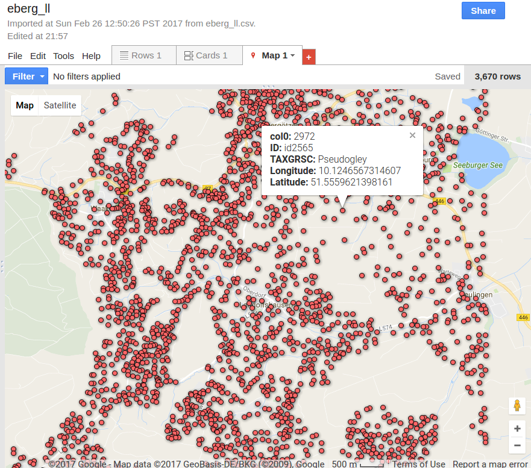
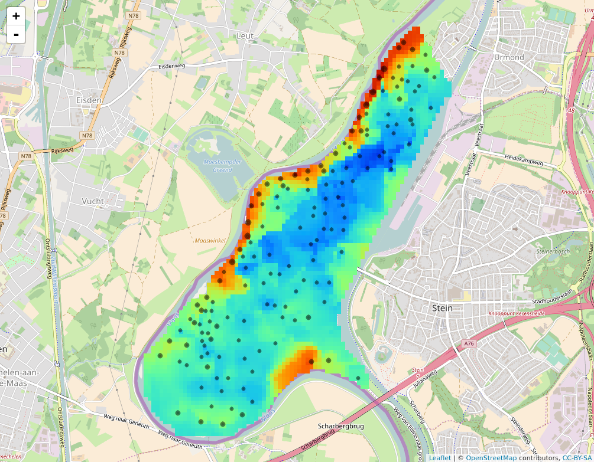

# Data Sharing
*T Hengl, L Poggio, E Ribeiro & B Kempen*

This Chapter reviews possibilities and “good practices” of exchanging produced soil data. Once the analysis, spatial prediction and quality control have been all completed, it is useful to follow some minimum steps and export and prepare the data for distribution so that its potential users can easily access it, use it, and make a correct interpretation of data. We consider geo-publishing options for soil data either based on using third-party web services or by using one’s own installation of the software. We put a clear focus on using the Open Source software solutions: GDAL, R, GeoServer, OpenLayers and Leaflet, and public domain data and metadata standards.

The authors have 15+ years of experience in producing, publishing and sharing soil maps and have been involved in large soil mapping projects where data volumes often exceed standard desktop GIS capacities. For information on specific software please refer to the provided links. Even more information on using GDAL and similar GIS tools through a command line can be found via the Global Soil Information Facilities tutorials of ISRIC at http://gsif.isric.org. The text is illustrated with example scripts of the statistical software R in combination with GDAL.

The authors of this Chapter used **R** packages. To run the code provided in this Chapter, the following packages need to be installed in the **R** user library. If the packages are not yet installed, the `install.packages()` function can be used.

```{r, eval=FALSE}
# Installing packages for Chapter 'Data Sharing'
install.packages(c("soiltexture", "rgdal", "plotKML",
                   "sf", "RSQLite", "leaflet",
                   "htmlwidgets", "GSIF", "raster"))
```


## Export Formats

### Type of Soil Data and Their Formatting

Before we start reviewing soil data formats, it is useful to understand which types of soil variables, soil maps, and soil DBs are most commonly generated and used, and what are their specific advantages and limitations. Soil science works with many variables common to ecology and/or physical geography (e.g. soil temperature), but it also works with several variables specific to soil science only. Some soil factor-type variables specific to soil science only are for example:

* Soil taxa or soil classes (this includes taxonomic systems and connected diagnostic soil properties and horizons).
* Soil texture-class systems.
* Soil color classification systems e.g. Munsell color codes.
* Soil drainage classes (hydrological classifications).
* Soil diagnostic horizons.

Consider for example the following soil texture data:

```{r, eval=FALSE}
library(soiltexture)
tex <- data.frame(
  CLAY = c(05,60,15,05,25,05,25,45,65,75,13,47),
  SILT = c(05,08,15,25,55,85,65,45,15,15,17,43),
  SAND = c(90,32,70,70,20,10,10,10,20,10,70,10)
 )
 
TT.plot(class.sys = "USDA.TT", tri.data = tex, main = "", 
        cex.axis=.7, cex.lab=.7)

```


The way soil texture data is displayed and texture classes (SaLo, Lo, Sa etc.) used in a texture triangle is specific to soil science. The way this data is formatted and presented can be, likewise, specific to soil science only.

Most of the soil data is in fact spatial. **“Spatial”** implies that spatial (and temporal) reference is attached to each measured/estimated value, i.e. it is location specific. Spatio-temporal references typically include for example: 
  
* Geographic location in local or geographic coordinates (ideally longitude and latitude in the WGS84 coordinate system);
* Depth interval expressed in cm from land surface (upper and lower depth);
* Support size or referent soil volume (or voxel) i.e. the horizontal sampling area multiplied by the thickness of the sampling block;
* Temporal reference i.e. begin and end date/time of the period of measurements/estimations.

Spatial data formats are used to represent spatial objects. This can be [@bivand2013classes, neteler2013open]:

* Points (2D or 3D): used to represent sampling locations, soil horizons, soil profiles etc.
* Lines (2D): used to represent soil transects, streams, administrative boundaries etc.
* Polygons (2D): used to represent soil mapping units and/or geomorphological units, landforms, administrative areas, farms, plot trials etc.
* Grids or rasters (2D or 2.5D): used to represent soil spatial predictions (spatially complete) of soil properties and classes etc.
* 3D grids or Voxels: used to represent soil spatial predictions (spatially complete) of soil properties in 3D.

It is also important to be able to distinguish between sampled or predicted soil data:

1. Soil samples (usually points or transects) are spatially incomplete. They are used to generate spatial predictions.
2. Spatial predictions of soil variables (soil maps) are spatially complete. They are used for decision making and further modeling i.e. they are used to construct a Soil Information System.


A collection of spatially exhaustive soil grids of various soil properties (physical and chemical soil properties, soil water, soil classification etc) make a **Soil Information System** (SIS). SIS are often complemented with soil sample data and serve both data formats. A Soil Information System should preferably be a **Database** (DB), so that users can access and query data using some standard DB languages (for example SQL). Steps to export soil data into a DB format are explained in later Sections.

### General GIS Data Formats: Vector, Raster, Table

All soil data we produce through soil mapping can be in principle distributed using one of the two basic GIS formats of data:

*    Vector format: this format is often more suitable for exporting point, line, and polygon (areal) data,
*    Raster or gridded format: this format is often more suitable for exporting spatial predictions of soil variables.

Data in vector format can be converted to raster (see e.g. rasterize function in the raster R package ) and vice versa — raster data can be converted to vector formats. For example, rasters can be converted to polygons (see e.g. rast2vect function in the plotKML package ). If the conversion is done carefully and if all the relations between scale and pixel size have been considered (see @hengl2006finding for more details), then information loss due to conversion from raster to vector and vice versa should be minimal.

Both vector and raster GIS data can also be converted to tabular data format. By converting a GIS layer to a table, spatial geometry and spatial relations will be ‘stripped off’, so that only limited spatial analysis operations can be applied. To convert raster layers to tabular data, consider using the **SpatialPixelsDataFrame-class** in the sp package  and/or the **RasterLayer-class** from the raster package  in combination with the rgdal package [@bivand2013classes]:


```{r, eval=FALSE}
library(rgdal)
library(plotKML)
?readGDAL
spnad83 <- readGDAL(system.file("pictures/erdas_spnad83.tif", 
                                package = "rgdal")[1])
spnad83.tbl <- as.data.frame(spnad83)
str(spnad83.tbl)

```

where as.data.frame is a function converting a raster object to a table. Note that the output table now contains coordinates for each cell (center of the grid node), which is in fact memory inefficient as coordinates are provided for each row in the table. 

Likewise, to convert a vector layer to tabular formats one can use the Simple Features functionality of the sf package . The SF standard is widely implemented in spatial databases (PostGIS, ESRI ArcGIS) and forms the vector data basis for libraries such as GDAL and web standards such as GeoJSON (http://geojson.org/). To convert for example spatial polygons layer to a tabular format we would use:

```{r, eval=FALSE}
library(sf); library(plotKML)
data(eberg_zones)
class(eberg_zones)
eberg_zones.tbl <- as(eberg_zones, "sf")
str(eberg_zones.tbl)

```
Note that using spatial layers in simple tabular formats can be cumbersome because many spatial relationships and properties are likely lost (although these can be assigned reversibly). In addition, the size of tabular objects is much bigger than if we use data in the original GIS data formats, especially if those formats support compression. On the other hand, having data in tabular format can be often the only way to exchange the data from spatial to non-spatial databases or from software without any data communication bridge. Also, tabular data is human-readable which means that it can be opened in text editors, spreadsheet programs or similar.

### Recommended GIS Data Exchange Formats

As a general recommendation producers of soil data should primarily look at using the following data formats for exchanging soil data (points, polygons, and rasters):

* GPKG  (an Open Format for Geospatial Information): platform-independent, portable, self-describing, compact format for transferring geospatial information. 
*    GeoTIFF (for rasters): a TIFF (image) file that allows embedding spatial reference information, metadata and color legends. It also supports internal compression algorithms and hierarchical indexing.

Both formats can be read easily in R or similar data processing software. Vectors are also commonly exported and shared in ESRI Shapefile (SHP) format. The advantage of GPKG format versus somewhat more common ESRI SHP format is that GPKG files are basically a portable database (SQLite container) so that the user does not have to import the whole data into a program but also fetch parts of data by using SQL queries and it can handle vector and raster data in it. The following example demonstrates how to create a GPKG file and how to query it:  

```{r, eval=FALSE}
library(RSQLite)
data(eberg)
coordinates(eberg) <- ~X+Y
proj4string(eberg) <- CRS("+init=epsg:31467")
writeOGR(eberg, "eberg.gpkg", "eberg", "GPKG")
con <- dbConnect(RSQLite::SQLite(), dbname = "eberg.gpkg")
df <- dbGetQuery(con, 'select "soiltype" from eberg')
summary(as.factor(df$soiltype))
dbGetQuery(con, 
           'select * from gpkg_spatial_ref_sys')[3,"description"]

```
Note that the RSQLite package is a generic package for connecting to SQLite DBs. This means that GPKG files can be accessed and updated in its native storage format without intermediate format translations. Just putting a GPKG file on a server with read and execute access allows users to connect and fetch data.

Alternatively, it is also a good idea to store point data in a non-spatial format such as simple tables. For example, in comma-separated file format (.csv). A fast way to publish and share tabular data is to use Google Fusion Tables™. Google Fusion Tables have an API  that allows accessing and using tabular data through various programming platforms. The limitation of using Google Fusion tables is, however, data size (currently about 1GB per user) and similar data volume limits, so this platform should be only used as an intermediate solution for smaller data sets.



GeoTIFF format is highly recommended for sharing raster data for the following reasons:

1.    It is GDAL's default data format and much functionality for subsetting, reprojecting, reading and writing GeoTIFFs already exists (see GDAL utils).
2.    It supports internal compression via creation options (e.g. “COMPRESS=DEFLATE”).
3.    Extensive overlay, subset, index, translate functionality is available via GDAL and other Open Source software. Basically, GeoTiff functions as a raster DB.

Consider for, example the **gdallocationinfo**  function which allows spatial queries following some indexing system such as row and column number:

```{r, eval=FALSE}
spnad83.file = system.file("pictures/erdas_spnad83.tif", 
                           package = "rgdal")[1]
system(paste0('gdallocationinfo ', spnad83.file, ' 100 100'))

```

Such type of overlay operations, thanks to GDAL [@warmerdam_geospatial_2008], are extremely fast and efficient. Likewise, **gdalwarp** function can be used subset rasters based on spatial extent or grid index. Rasters can be imported to GeoServer and shared through Web Coverage Service (see Section \@ref(webService)) or similar likewise function as a spatial raster DB.

As a general recommendation, and to avoid large file sizes, we recommend, however, that you always use integers inside GeoTiffs because floating point formats can lead to up to 4+ times larger sizes (without any gains in accuracy). This might mean you have to multiply the values of the soil property of interest by 10 or 100, in order not to lose accuracy (e.g. multiply pH values by 10 before exporting your raster as a GeoTiff).

## Web Services: Serving Soil Data Using Web Technology {webService}

### Third-Party Services

If you are a data producer but with limited technical capacity and/or financial resources, then publishing geo-data through a third-party service could be very well that the easiest and most professional solution for you. Some commonly used commercial web-services to share geo-data are:

*    Google MyMaps (https://www.google.com/mymaps)
*    ArcGIS Online (https://www.arcgis.com/home/)
*    MapBox (https://www.mapbox.com/)
*    CARTO (https://carto.com/)

All these have limitations and primarily suitable for sharing vector type data only. Their free functionality is very limited so before you start uploading any larger data sets, please check the size limits based on your account. Upgrading your license will allow you to increase storage and functionality so that even with few hundred dollars per year you could have a robust solution for sharing your data with thousands of users.

Soil data producers can also contact ISRIC, as World Data Centre for Soils, to request support for hosting and/or distributing their soil data in case they lack the technical capacity to do so themselves while adhering to the data sharing agreement and license set by the data producer.

### GeoServer (Web Serving and Web Processing)

GeoServer (http://geoserver.org/) is Open Source software solution for serving raster or vector data. It includes the majority of the Open Geospatial Consortium Service standards: the Web Map Service, Web Coverage Service and Web Processing Service [@youngblood2013geoserver]. Installation and maintenance of GeoServer is however not trivial and requires specialized technical staff. Web services can also entail significant costs depending on the amount of web-processing and web-traffic. For every medium to large size organization, it is probably a better idea to use the out-of-box solution for GeoServer which is the GeoNode (http://geonode.org/). GeoNode also includes a web-interface and user-management system so that new layers can be uploaded to GeoServer through a web-form type interface.

The very important functionality of GeoServer are the OGC standard services such as the **Web Coverage Service** (WCS) and the **Web Feature Service** (WFS). WCS means that not only data views are available to users, but WCS can also do data translation, aggregation or resampling, overlay etc. Consider for example the SoilGrids WCS  (which can also be opened in QGIS or similar software supporting WCS). Users can direct this WCS and request only a subset of data for some area, aggregated to some preferred resolution/pixel size by using gdal_translate or similar. This means that, in few steps, users can download a subset of data on GeoServer in a preferred format without a need to download the whole dataset.


### Visualizing Data Using Leaflet and/or Google Earth

A quick way to visualize produced soil maps and then share them to users without GIS capacities is to use Leaflet package . Leaflet is basically a stand-alone web-page that contains all information (including some popular Web Mapping Services) so that users can visually explore patterns without having to install and use any desktop GIS. Consider the following example:

```{r, eval=FALSE}
library(leaflet)
library(htmlwidgets)
library(GSIF)
library(raster)
demo(meuse, echo=FALSE)
omm <- autopredict(meuse["om"], meuse.grid[c("dist","soil","ffreq")],
                   method="ranger", auto.plot=FALSE, rvgm=NULL)
meuse.ll <- reproject(meuse["om"])
#Reprojecting to +proj=longlat +datum=WGS84 ...
m = leaflet() %>% addTiles() %>% addRasterImage(raster(omm$predicted["om"]), 
  colors = SAGA_pal[[1]][4:20]) %>% addCircles(lng = meuse.ll@coords[,1], 
    lat = meuse.ll@coords[,2], color = c('black'), radius=meuse.ll$om)  
saveWidget(m, file="organicmater_predicted.html")

```


Note that the whole data set including styling and legends is basically available through a single HTML file (organicmater_predicted.html). Anyone opening that HTML in their browsers will get an interactive web-map that contains both samples and spatial predictions.

An alternative to using Leaflet is to put all data, including documents and multimedia, about your project in a KML (Keyhole Markup Language) file, so the data is available for viewing in Google Earth [@hengl2015plotkml]. KML is very rich in what it can incorporate: textual data, photographs, documents, animations, videos etc. In fact, probably whole projects can be put into a single KML file so that the users only need to open it in Google Earth and then explore interactively. Note that KML files with ground overlays will be generated by GeoServer by default, although further customization is up to the data producer.

## Preparing Soil Data for Distribution

### Metadata

One important thing to consider prior to data distribution is construction of metadata (explanation of data, how was it produced and what are the exact technical specifications). There are several metadata standards that can be used to prepare metadata. More recently, complete and consistent metadata is a requirement by many government agencies and organizations. There are now several public metadata validators that run all possible consistency and completeness checks before the metadata (and data) can be accepted.

Typical metadata should (at least) contain:

*    Detailed description of the variables available in the data.
*    Data license and terms of use (URL).
*    Explanation of measurement methods and units used.
*    Mention of the reference support size including referent depth intervals to which the soil data refers to (e.g. 0–30 cm depth interval).
*    Mention of the referent time period in which the calibration data was collected.
*    Link to literature (report, book or scientific article) where the data production is explained in detail. Using a published and peer-reviewed scientific article as the main reference for data is a good practice since it also shows that the data production process has been evaluated by independent researchers.
*    Project homepage i.e. URL containing more information and especially up-to-date contacts where users can find original data producers and request support.

Metadata (including color legends) can be also directly embedded into the GeoTiff file by using the gdal_edit command  available in GDAL. The following example shows how to add a simple explanation of the data and a URL to find more info about the GeoTiff:

```{r, eval=FALSE}
data("eberg_grid")
gridded(eberg_grid) = ~ x+y
proj4string(eberg_grid) <- CRS("+init=epsg:31467")
writeGDAL(eberg_grid["DEMSRT6"], "eberg_DEM.tif", 
            options="COMPRESS=DEFLATE")
?eberg
system(paste0('gdal_edit.py 
-mo \"DESCRIPTION=elevation values from the SRTM DEM\" 
-mo \"DOWNLOAD_URL=http://geomorphometry.org/content/ebergotzen\"
eberg_DEM.tif'))
system('gdalinfo eberg_DEM.tif')

```

Similarly, all necessary metadata can be added into GeoTiff so that future users have all information at one place i.e. inside the data file. 

### Exporting Data: Final Tips

As we have shown previously, if you export soil data into either GPKG and/or GeoTiff, these data can be accessed using DB operations. In fact, by exporting the data to GPKG and GeoTiffs, you have created a soil spatial DB or a soil information system. This does not necessarily mean that its targeted users will be able to find all information without problems and/or questions. How usable and how popular a data set is, is a function of many aspects, not only data quality. You could create maps of perfect quality but have no users at all. Some things you should definitively consider, as a way to boost the usability of your data are:

1.    Make a landing page for your data that includes: (1) simple access/download instructions, (2) screenshots of your data in action (people prefer visual explanations with examples), (3) links to key documents explaining how the data was produced, and (4) workflows explaining how to request support (who to contact and how).
2.    Make data accessible from multiple systems e.g. both via WCS, FTP and through a mirror site. This might be inefficient considering there will be multiple copies of the same data, but sometimes it quadruples data usage.
3.    Explain the data formats used to share data, and point to tutorials that explain how to access and use data to both beginners and advanced users.
4.    Consider installing and using a version control system (or simply use GitHub or similar repository) so that the users can track back versions of data.
5.    Consider closely following principles of reproducible research  (all processing steps, inputs, and outputs accessible). This tutorial comes with R code that is available via GitHub so that everyone should be able to reproduce the examples shown in the text.

## Export Formats 

The produced results need to be exported in formats that can be easily read by a variety of GIS software. Two widely used formats for raster data are GeoTIFF and KML.

GeoTIFF is a public domain metadata standard which allows georeferencing information to be embedded within a TIFF file. The potential additional information includes map projection, coordinate systems, ellipsoids, datums, and everything else necessary to establish the exact spatial reference for the file. Keyhole Markup Language (KML) is an XML notation for expressing geographic annotation and visualization within Internet-based, two-dimensional maps and three-dimensional Earth browsers. KML became an international standard of the Open Geospatial Consortium in 2008. 

Raster data in GeoTIFF format need a defined geographic projection. Each country has its own national system (or systems). In order to construct a mosaic of national datasets, a common projection has to be defined and national data need to be re-projected in the common projection. Data projections can be managed using open source tools such as GIS software, GDAL tools suite (http://www.gdal.org/) and various packages of the R software (https://www.r-project.org/). Projections can be defined according to different standards. A common way is the EPSG database. EPSG Geodetic Parameter Dataset is a collection of definitions of coordinate reference systems and coordinate transformations which may be global, regional, national or local application. A numeric code is assigned to each of the most common projections, making easier to refer to them and to switch between them. One of the most common global projections is WGS84 (EPSG 4336), used for maps and by the GPS satellite navigation system.

Each file should be accompanied by a set list of metadata. Geospatial metadata is a type of metadata that is applicable to objects that have an explicit or implicit geographic extent. While using GeoTIFF files it is possible to define a metadata field in which information can be recorded. Metadata can be edited with most GIS software and directly with GDAL tools (http://www.gdal.org/gdal_edit.html).

GDAL:  gdalwarp -t_srs 'xxx' input.tif output.tif where t_srs is the target spatial reference set, i.e. the coordinate systems that can be passed are anything supported by the  GRSpatialReference.SetFromUserInput() call, which includes EPSG PCS and GCSes (i.e. EPSG:4326), PROJ.4 declarations or the name of a .prj file containing well known text. For further information see http://www.gdal.org/gdalwarp.html 
