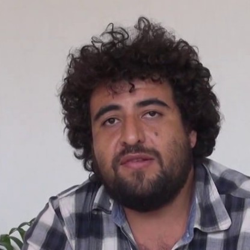
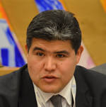

--- 
title: "Soil Organic Carbon Mapping cookbook"
author: ""
date: "`r Sys.Date()`"
site: bookdown::bookdown_site
output: bookdown::gitbook
cover-image: "images/cover.png"
documentclass: book
papersize: b5
fontsize: 10pt
bibliography: "References.bib"
biblio-style: apalike
link-citations: yes
description: "The soilll cookbook."
---

```{r set-options, echo=FALSE, cache=FALSE}
options(width = 65)

library(kableExtra)

## redefine str for the width option
str <- function(...){
  utils::str(..., strict.width = "cut")}

# reproducible results
set.seed(123)

## Boolean object for running all the code #####
# if FALSE will use precalculated RK prediction and svm tuning
RUN.ALL <- TRUE

# Cache results
knitr::opts_chunk$set(cache=T)
```


\frontmatter
\addtocontents{toc}{\protect\hypersetup{hidelinks}}   
\addtocontents{lot}{\protect\hypersetup{hidelinks}}
\addtocontents{lof}{\protect\hypersetup{hidelinks}}

# Copyright and disclaimer {-}

**Recommended citation:**

> FAO. 2018. Soil Organic Carbon Mapping Cookbook. Y Yigini, GF Olmedo, K Viatkin, R Baritz, and RR Vargas, (Eds). 2nd edition, 2018. 

The designations employed and the presentation of material in this information product do not imply the expression of any opinion whatsoever on the part of the Food and Agriculture Organization of the United Nations (FAO) concerning the legal or development status of any country, territory, city or area or of its authorities, or concerning the delimitation of its frontiers or boundaries. The mention of specific companies or products of manufacturers, whether or not these have been patented, does not imply that these have been endorsed or recommended by FAO in preference to others of a similar nature that are not mentioned.

The views expressed in this information product are those of the author(s) and do not necessarily reflect the views or policies of FAO. 

ISBN [insert number]

\copyright FAO, 2018

FAO encourages the use, reproduction and dissemination of material in this information product. Except where otherwise indicated, material may be copied, downloaded and printed for private study, research and teaching purposes, or for use in non-commercial products or services, provided that appropriate acknowledgement of FAO as the source and copyright holder is given and that FAO’s endorsement of users’ views, products or services is not implied in any way. 

All requests for translation and adaptation rights, and for resale and other commercial use rights should be made via www.fao.org/contact-us/licence-request or addressed to copyright@fao.org. 


FAO information products are available on the [FAO website](www.fao.org/publications) and can be purchased through publications-sales@fao.org. 


# Foreword to the First Edition {-}

This cookbook provides step-by-step guidance for developing 1 km grids for soil carbon stocks. It includes the preparation of local soil data, the compilation and pre-processing of ancillary spatial data sets, upscaling methodologies, and uncertainty assessments. Guidance is mainly specific to soil carbon data, but also contains many generic sections on soil grid development, as it is relevant for other soil properties.

Therefore, this first edition is the beginning of a series of updates and extensions, necessary to cover a larger variety of upscaling approaches. Experiences gained throughout 2017 during the GSOCmap programme, through applications at country scale and various trainings scheduled for 2017, shall be considered in the next editions. Also, the section on uncertainties will be adjusted to more practical implementation steps.

## Foreword to the Second Edition {-}

This edition has been updated with knowledge and practical experiences gained during the implementation process of GSOCmap V1.0 throughout 2017. The cookbook includes step-by-step guidance for developing 1 km grids for SOC stocks, as well as for the preparation of local soil data, the compilation and preprocessing of ancillary spatial data sets, upscaling methodologies, and uncertainty assessment methods. Guidance is mainly specific to SOC data, but as this cookbook contains generic sections on soil grid development it can be applicable to map various soil properties. 

\clearpage
## Editorial Board {-}


* Yusuf Yigini, Guillermo Federico Olmedo, Kostiantyn Viatkin, Rainer Baritz, Ronald R. Vargas
Global Soil Partnership, Food and Agriculture Organization of the United Nations

## Contributing Authors {-}

|               |                                      |
|------|--------------------------------------|
|    |  Rainer Bartiz - Food and Agriculture Organization of the United Nations |
|      |  Dick Brus - Department of Plant Sciences, Wageningen University, the Netherlands |
|   |  Mario Guevara - University of Delaware, USA |
|     |  Tomislav Hengl - ISRIC - World Soil Information, Wageningen, the Netherlands |
| |  Gerard Heuvelink - World Soil Information, Wageningen, the Netherlands |
|    |  Bas Kempen - ISRIC, World Soil Information, Wageningen, the Netherlands |
|   |  Titia VL Mulder - Wageningen University, Department of Environmental Sciences, the Netherlands |
|    |  Guillermo Federico Olmedo - Instituto Nacional de Tecnología Agropecuaria, Mendoza, Argentina |
|    |  Laura Poggio - The James Hutton Institute, Craigiebuckler Aberdeen, Scotland UK |
|   |  Eloi Ribeiro - ISRIC , World Soil Information, Wageningen, the Netherlands |
|     |  Christian Thine Omuto - Department of Environmental and Biosystems Engineering, University of Nairobi, Kenya |
|    |  Yusuf Yigini - Food and Agriculture Organization of the United Nations |
|    |  Ronald R Vargas - Food and Agriculture Organization of the United Nations |

